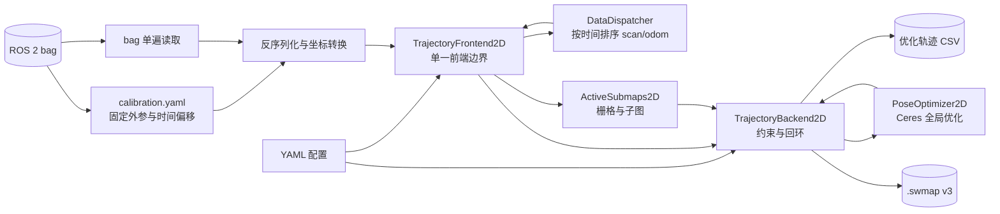

# Cartographer Bag 输入架构

## 1. 文档范围

本文描述 SweepNav 当前裁剪版 Cartographer 从 ROS 2 bag 输入到轨迹和 `.swmap`
输出的真实执行链路。它不是上游 Cartographer 的通用架构说明；当前程序只面向：

- 单个 ROS 2 bag；
- 单条新建轨迹；
- 一个 `sensor_msgs/msg/LaserScan` 类型的 `/scan`；
- 一个 `nav_msgs/msg/Odometry` 类型的 `/odom`；
- bag 同目录 `calibration.yaml` 提供的传感器外参；
- 2D 建图，或加载冻结 `.swmap` 后定位。

入口是 `application/bag_runner.cc`，配置入口是
`config/iilabs3d_offline.yaml`。不支持 PointCloud2、MultiEchoLaserScan、GPS、
landmark、fixed-frame 数据和外部 IMU 输入。

## 2. 总体数据流



核心所有权关系是：`MapBuilder` 同时拥有线程池、一个 `DataDispatcher`、一个
`TrajectoryBackend2D` 和前端数组。每条轨迹只对应一个 `TrajectoryFrontend2D`。它登记排序回调、
执行局部 SLAM，并把 node/odometry 转交共享的 `TrajectoryBackend2D`，不再经过多层 builder 包装
和虚接口。

```text
MapBuilder
├── ThreadPool
├── DataDispatcher
├── TrajectoryBackend2D
│   ├── ConstraintEngine2D（内部约束引擎）
│   └── PoseOptimizer2D（内部 Ceres 求解器）
└── TrajectoryFrontend2D[trajectory_id]
    ├── sensor ordering callback
    ├── PoseExtrapolator
    ├── scan matchers
    ├── ActiveSubmaps2D
    └── TrajectoryBackend2D（非拥有指针）
```

## 3. 启动和装配

`bag_runner` 按以下顺序装配系统：

1. 解析命令行参数并读取 YAML；
2. 生成 `MapBuilderOptions` 和 `TrajectoryBuilderOptions`；
3. 校验配置只声明当前支持的输入；
4. 创建 `MapBuilder`；其内部持有后台线程池，并将线程池作为执行资源注入
   `TrajectoryBackend2D` 的内部任务引擎；
5. 如果指定 `--offline_load_state_filename`，先读取并冻结旧地图；
6. 为 `scan` 和 `odom` 注册一条新轨迹；
7. 创建一个 `TrajectoryFrontend2D` 并注册 scan/odom 排序回调；
8. 加载标定文件，单遍回放传感器数据。

传给 `AddTrajectoryBuilder()` 的 sensor ID 是内部稳定名称 `scan` 和 `odom`。
它们同时也是 `DataDispatcher` 的队列键，不是从 bag 中动态发现的任意话题名称。

### 3.1 MapBuilder、TrajectoryBackend2D 和线程池的职责

三者不是平行的 SLAM 模块，前后端边界和所有权关系如下：

```text
MapBuilder（装配与生命周期容器）
├── DataDispatcher
├── TrajectoryFrontend2D                   ← SLAM 前端
├── TrajectoryBackend2D                    ← 唯一公开 SLAM 后端
└── ThreadPool                             ← 后端执行资源
     └── 注入 TrajectoryBackend2D
```

因此，前后端并行指的是 bag 回放和 `TrajectoryFrontend2D` 继续处理 scan 时，
`TrajectoryBackend2D` 可以在后台推进已提交 node 的约束工作；不是说 `MapBuilder`、`TrajectoryBackend2D` 和
`ThreadPool` 分别代表三个同级模块。

`MapBuilder` 是装配和生命周期入口，本身不执行具体 SLAM 算法。它持有线程池、
`TrajectoryBackend2D`、`DataDispatcher` 以及各条 frontend，负责创建轨迹、结束轨迹、
加载/保存 `.swmap`。当前虽然只有一条轨迹，仍由它统一保证这些对象的析构顺序：必须先
等待图计算完成，才能销毁被后台任务引用的 submap、node 和 scan matcher。

`TrajectoryBackend2D` 保存全局状态，包括 trajectory node、submap、约束和优化后的全局位姿。
局部 SLAM 每产生一个 node，`TrajectoryBackend2D` 就为它寻找可匹配的 submap、生成约束，并按
`optimize_every_n_nodes` 触发一次全局优化。局部 scan matching 负责“当前扫描放在哪里”，
TrajectoryBackend2D 则负责“历史 node/submap 整体怎样保持一致并闭环”。

`ConstraintEngine2D` 和 `PoseOptimizer2D` 是后端私有实现组件：前者生成候选约束，后者
求解已经确定的约束。`MapBuilder`、`TrajectoryFrontend2D`、bag runner 和序列化层都只
依赖 `TrajectoryBackend2D`，不能直接访问这两个组件。这样对外只有一个后端边界，同时
避免把并发任务状态与 Ceres 数值状态混进同一个巨型类。

线程池只服务于 TrajectoryBackend2D 后台工作，不用于并行读取 bag，也不改变 `scan/odom` 的时间
顺序。当前配置 `map_builder.num_background_threads: 4`，主要执行：

- 构建每个 submap 的 `FastCorrelativeScanMatcher2D` 搜索结构；
- 并行计算不同 node-submap 候选的局部约束和全局闭环约束；
- 按依赖关系汇总一个 node 的约束，随后串行更新 TrajectoryBackend2D 工作队列；
- 等约束全部完成后执行全局优化回调。

之所以保留线程池，是因为约束搜索通常比单帧局部 SLAM昂贵，而且不同候选彼此独立。
如果全部放到 bag 回放线程同步执行，每插入一个 node 都可能阻塞后续 scan，离线回放时间
会显著增加。这里的 `Task` 还表达了“先建立 submap scan matcher，再计算约束；所有约束
完成后才能优化”的依赖关系，并非单纯封装 `std::thread`。

线程池不是 SLAM 数学上的必要条件：可以重写成单线程同步流水线，但不能只删除
`ThreadPool`。那样需要同时改写 `ConstraintEngine2D::WhenDone()`、TrajectoryBackend2D 工作队列和
`WaitForAllComputations()` 的完成协议。当前保留它的核心理由是约束计算吞吐和已有任务依赖
语义，而不是因为 bag 输入本身需要多线程。

## 4. Bag 单遍读取

每个源 bag 目录固定保存自己的 `calibration.yaml`。benchmark worker 生成只包含
`/scan` 和 `/odom` 的规范化 `native_input` bag，并把源标定文件原样复制到同目录，
不在运行时推导或改写标定。IILABS3D 的 odometry child frame 已经是配置的
`tracking_frame`（`eve/base_footprint`），因此对应外参为单位矩阵。

`bag_runner` 启动时读取一次标定文件，然后只打开一个 `rosbag2_cpp::Reader`：

- `/scan`：反序列化 LaserScan，过滤非有限值和量程外点，把极坐标转为带点内相对
  时间的点云，再用 `T_tracking_sensor` 变换到 `tracking_frame`，形成
  `TimedPointCloudData`；
- `/odom`：校验 reference/child frame，再用 `T_tracking_child` 把 pose 统一到
  tracking frame，形成 `OdometryData`；
- 其他话题：忽略。

标定文件采用 `T_parent_child` 约定，即矩阵把 child 坐标表达转换为 parent 坐标表达；
同时记录 schema、单位、topic、消息类型、frame、pose 约定及传感器时间偏移。矩阵使用
OpenVINS 风格的 4×4 齐次形式。runner 会检查矩阵末行、旋转正交性、行列式和消息中的
frame，避免方向写反或标定与 bag 不匹配。

LaserScan 的数据时间定义为最后一个有效扫描点所在时刻；各点的时间改写为相对该时刻
的非正偏移。这是后续运动补偿和 pose extrapolation 的时间基准。

## 5. 时间排序与分派

`TrajectoryFrontend2D` 把两种强类型数据直接提交给 `DataDispatcher`。
dispatcher 使用 C++20 `std::variant<TimedPointCloudData, OdometryData>` 保存数据，
为 `(trajectory_id, sensor_id)` 各维护一个无锁 `std::deque`，并保证：

- scan 和 odom 按数据时间全局递增分派；
- 两个传感器都到达共同起始时间之前，不提前释放不确定顺序的数据；
- 单个队列缺数据时暂停分派；
- `FinishTrajectory()` 标记所有队列结束并排空剩余数据。

排序后的数据通过 `std::visit` 进入 `TrajectoryFrontend2D::ProcessSensorData()` 的强类型
重载，不再创建 `sensor::Data` 虚对象，也不经过 builder 虚接口、`BlockingQueue` 或
`OrderedMultiQueue`。bag 文件中消息的物理排列可以交错，但每个
传感器自身仍必须保持时间有序。当前 bag reader 是唯一生产者，后台 TrajectoryBackend2D 不会写
传感器队列，因此 dispatcher 明确采用单线程同步模型。

## 6. `/scan` 的局部 SLAM 路径

一次 scan 进入 `TrajectoryFrontend2D` 后，由内部局部匹配实现依次经过：

1. 校验输入是唯一的 `scan` sensor，且帧内点时间单调递增；
2. `PoseExtrapolator` 根据已有 pose 和 odometry 预测扫描期间姿态；
3. 把逐点数据变换到重力对齐坐标系并做距离过滤；
4. 按配置累积若干帧并做 voxel filtering；
5. 用预测位姿作为 scan matching 初值；
6. 可选实时相关匹配产生较稳健的粗位姿；
7. Ceres scan matcher 对当前活动子图做精配准；
8. motion filter 判断此次结果是否值得插入；
9. 将 range data 插入 `ActiveSubmaps2D`；
10. 返回 `MatchingResult`，插入成功时同时返回节点数据和关联子图。

局部 SLAM 输出的是 `local` 坐标系下的连续位姿。它不会直接修改全局优化结果。

### 6.1 PoseExtrapolator 的预测原理

一帧 LaserScan 不是瞬时拍摄：每个点带有相对帧末时间 `δtᵢ ≤ 0`。机器人在扫描
期间仍然运动，如果把所有点都当成帧末同一姿态采集，墙面会被拉弯或重影。
`PoseExtrapolator` 的首要用途就是为每个点计算采样时刻
`tᵢ = t_scan_end + δtᵢ` 的预测位姿，完成逐点运动补偿（deskew）。

预测器维护一个短时 pose 队列，队列中的 pose 是此前 scan matching 已经校正过的局部
位姿。初始化时在第一帧 scan 的结束时间加入单位位姿。此后每次 scan matching 成功，
新的 `pose_estimate` 都通过 `AddPose()` 反馈进队列，重新估计速度。

速度来源有优先级：

1. 至少有两条 odometry 时，用最早和最新 odometry 的相对变换估计 tracking frame 下
   的线速度与角速度；
2. odometry 尚不足两条时，用 pose 队列首尾两个已匹配位姿的差分速度；
3. 初始化阶段还没有足够时间跨度时，速度保持零，预测位姿等于最近位姿。

对最近校正位姿 `T_local_tracking(t₀) = (R₀, p₀)` 和时间差
`Δt = t - t₀`，实现采用完整刚体恒速模型，而不只是平移速度补偿：

```text
p(t) = p₀ + v · Δt
R(t) = R₀ · Exp(ω · Δt)
```

其中 `v` 和 `ω` 优先取 odometry 差分结果。代码使用 `ImuTracker` 积分角速度来实现
旋转指数映射，但当前没有外部 IMU 输入；每次推进只注入 odometry/pose 推导出的角速度
和固定 `UnitZ` 合成重力。因此这里的 gravity alignment 在 2D 产品中主要用于维持
roll/pitch 与水平面一致，不能解释为真实 IMU 融合。

因此每个点使用的都是包含位置和朝向的
`T_local_tracking(tᵢ) = (R(tᵢ), p(tᵢ))`：

```text
p_local(tᵢ) = T_local_tracking(tᵢ) · p_tracking(tᵢ)
```

这里先在 `local` 坐标系完成逐点 deskew，是因为不同采样时刻的 tracking frame 在运动，
而 local frame 是这一小段时间内共同的静止参考。随后以扫描帧末姿态为基准，把累计点云
变换到重力对齐坐标系：

```text
T_gravity_local = R_gravity_tracking(t_end) · inverse(T_local_tracking(t_end))
p_gravity       = T_gravity_local · p_local
```

其中 `R_gravity_tracking` 来自 `EstimateGravityOrientation()`。当前没有真实 IMU，因此它
使用合成 `UnitZ` 约束 roll/pitch，yaw 仍由 odometry/历史 pose 的角速度推进。也就是说：
运动补偿使用完整 3D 姿态，scan matching 前才将重力对齐后的帧末预测投影为 2D 位姿。

预测有两个消费位置：

- 对 scan 内每个点调用 `ExtrapolatePose(tᵢ)`，把点和雷达原点变换到运动补偿后的
  local 坐标；
- 对帧末调用 `ExtrapolatePose(t_scan_end)`，投影为 2D 后作为 scan matcher 的搜索
  初值。

它不是最终位姿来源。最终局部位姿由 scan matcher 对活动子图校正：

```text
上一帧匹配的 Rigid3 位姿 + odometry 线/角速度积分
                  ↓
           scan matching 初值
                  ↓
       子图观测校正后的 pose_estimate
                  ↓
         回写 PoseExtrapolator
```

因此 odometry 短时稳定时可缩小匹配搜索范围；odometry 有累计漂移时，激光与子图匹配会
持续校正局部预测，而后端 TrajectoryBackend2D 再负责更长时间尺度的回环和全局一致性。

## 7. `/odom` 的双路径

Odometry 经 `TrajectoryFrontend2D` 后分成两路：

- 送入前端内部的局部匹配实现，供 `PoseExtrapolator` 做实时姿态预测；
- 送入 `TrajectoryBackend2D` 保存为全局优化的 odometry 约束数据。

第二路可以由 `pose_graph_odometry_motion_filter` 降采样。当前没有外部 IMU 输入；局部
姿态推演使用 odometry、已估计 pose 的角速度以及内部合成重力方向。

## 8. 从局部结果到 TrajectoryBackend2D

`TrajectoryFrontend2D` 是唯一的前端入口，也是前端与后端的边界：

- 只有产生 `MatchingResult` 的 scan 才形成一次局部 SLAM 输出；
- 只有通过 motion filter、带 `InsertionResult` 的结果才调用
  `TrajectoryBackend2D::AddNode()`；
- 新节点携带常量观测数据和其插入的一个或多个子图；
- TrajectoryBackend2D 立即建立 intra-submap 约束，并在后台搜索 inter-submap/回环约束；
- 达到配置的节点数后触发一次全局优化。

`ConstraintEngine2D` 使用快速相关扫描匹配器寻找候选，再用 Ceres 细化约束。
`PoseOptimizer2D` 联合优化节点位姿、子图位姿和 odometry 关系。优化完成后执行
trimmer，删除定位模式下不再需要保留的旧子图。

## 9. 建图与冻结地图定位

### 9.1 新图模式

不传 `--offline_load_state_filename` 时，TrajectoryBackend2D 从空状态开始。新轨迹持续创建节点和
子图，结束后完整优化，并可输出新的 `.swmap`。

### 9.2 已知地图定位模式

传入 `.swmap` 时，`MapBuilder::LoadStateFromFile()`：

1. 校验并读取当前 v3 schema；
2. 为文件中的轨迹创建新的内部 trajectory ID；
3. 恢复子图、节点、轨迹数据和 intra-submap 关系；
4. 把恢复的轨迹标记为 frozen；
5. 另建一条活动轨迹接收当前 bag 的 scan/odom；
6. 通过新节点到冻结子图的约束完成定位。

当前原生加载只允许 frozen map，不支持继续修改已加载的历史轨迹。

## 10. 结束、优化与输出

bag 读完后的顺序不可交换：

1. `MapBuilder::FinishTrajectory()` 结束并排空 sensor queues；
2. `TrajectoryBackend2D::FinishTrajectory()` 标记轨迹完成；
3. `TrajectoryBackend2D::RunFinalOptimization()` 等待后台约束任务并做最终全局优化；
4. 从 `GetTrajectoryNodes()` 写优化后的 `timestamp,x,y,theta` CSV；
5. 可选调用 `SerializeStateToFile(true, ...)` 写 `.swmap`。

`.swmap` 由 `serialization/swmap.*` 负责，保存轨迹、子图栅格、节点、约束和轨迹
数据。它是持久化边界，不拥有运行时 TrajectoryBackend2D 状态。

## 11. 线程和阻塞边界

- bag 读取、消息反序列化、标定变换、`DataDispatcher` 分派和局部 SLAM 在主线程推进；
- TrajectoryBackend2D 通过 `ThreadPool` 并行计算候选约束；
- TrajectoryBackend2D 的 work queue 串行化会修改全局图状态的操作；
- `RunFinalOptimization()` 是最终同步屏障，返回后才能导出稳定轨迹和地图；
- `DataDispatcher` 若等待某个 sensor queue，会停止整个轨迹的数据分派，因此缺失 `/scan` 或
  `/odom` 不能被当作可选输入。

## 12. 目录与职责对应

| 目录 | 在 bag 链路中的职责 |
|---|---|
| `application/` | 参数、bag 单遍读取、ROS 消息转换、生命周期控制 |
| `core/` | 时间、传感器数据、DataDispatcher、点云、变换、线程池和指标 |
| `trajectory/` | 单一 `TrajectoryFrontend2D` 前端边界与配置 |
| `local/` | 局部 SLAM、姿态预测、运动过滤和 range 汇聚 |
| `scan_matching/` | 局部匹配及全局约束搜索使用的匹配算法 |
| `mapping/` | MapBuilder、栅格和子图生命周期 |
| `pose_graph/` | 节点/子图约束、回环、全局优化与裁剪 |
| `serialization/` | `.swmap` v3 读写 |

新增代码应按主要状态所有权落位，不应重新建立 `slam/` 汇总目录，也不应创建超过
`cartographer/<职责>/<文件>` 的源码层级。

## 13. 关键入口索引

| 入口 | 文件 |
|---|---|
| bag 主流程 | `application/bag_runner.cc` |
| 栈装配与状态加载 | `mapping/map_builder.cc` |
| 时间排序 | `core/data_dispatcher.cc`、`trajectory/collated_trajectory_builder.cc` |
| 前后端桥接 | `trajectory/global_trajectory_builder.cc` |
| 局部 SLAM | `local/local_trajectory_builder_2d.cc` |
| 子图和栅格 | `mapping/submap_2d.cc`、`mapping/grid_2d.cc` |
| 单一后端入口与工作流 | `pose_graph/trajectory_backend_2d.{h,cc}` |
| 后端只读查询 | `pose_graph/trajectory_backend_query_2d.cc` |
| 内部约束引擎 | `pose_graph/constraint_engine_2d.{h,cc}` |
| 内部位姿优化器 | `pose_graph/pose_optimizer_2d.{h,cc}` |
| 约束计算 | `pose_graph/constraint_engine_2d.cc` |
| 全局优化 | `pose_graph/pose_optimizer_2d.cc` |
| 状态持久化 | `serialization/swmap.cc` |
