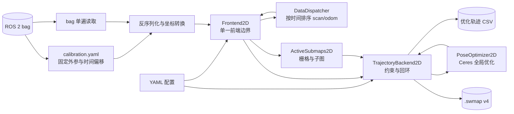

# Cartographer Bag 输入架构

> 文档导航：[首页](README.md) · [入门教程](GETTING_STARTED.md) ·
> [模块索引](MODULES.md) · [配置参考](CONFIGURATION_REFERENCE.md) ·
> [C++ API](API_REFERENCE.md)

## 1. 文档范围

本文描述 SweepNav 当前裁剪版 Cartographer 从 ROS 2 bag 输入到轨迹和 `.swmap`
输出的真实执行链路。它不是上游 Cartographer 的通用架构说明；当前程序只面向：

- 单个 ROS 2 bag；
- 单条新建轨迹；
- 一个 `sensor_msgs/msg/LaserScan` 类型的 `/scan`；
- 一个 `nav_msgs/msg/Odometry` 类型的 `/odom`；
- bag 同目录 `calibration.yaml` 提供的传感器外参；
- 2D 建图，或加载冻结 `.swmap` 后定位。

入口是 `application/bag_runner.cc`，配置入口是
`config/iilabs3d_offline.yaml`。不支持 PointCloud2、MultiEchoLaserScan、GPS、
landmark、fixed-frame 数据和外部 IMU 输入。

## 2. 总体数据流



核心所有权关系是：`SlamSystem` 同时拥有任务执行器、一个 `DataDispatcher`、一个
`TrajectoryBackend2D` 和前端数组。每条轨迹只对应一个 `Frontend2D`。它登记排序回调、
执行局部 SLAM，并把 node/odometry 转交共享的 `TrajectoryBackend2D`，不再经过多层 builder 包装
和虚接口。

```text
SlamSystem
├── TaskExecutor
├── DataDispatcher
├── TrajectoryBackend2D
│   ├── ConstraintEngine2D（内部约束引擎）
│   └── PoseOptimizer2D（内部 Ceres 求解器）
└── Frontend2D[trajectory_id]
    ├── sensor ordering callback
    ├── PoseExtrapolator
    ├── scan matchers
    ├── ActiveSubmaps2D
    └── TrajectoryBackend2D（非拥有指针）
```

## 3. 启动和装配

`bag_runner` 按以下顺序装配系统：

1. 解析命令行参数并读取 YAML；
2. 生成 `SlamSystemOptions` 和 `TrajectoryBuilderOptions`；
3. 校验配置只声明当前支持的输入；
4. 创建 `SlamSystem`；其内部持有后台 `TaskExecutor`，并将其作为执行资源注入
   `TrajectoryBackend2D` 的内部任务引擎；
5. 如果指定 `--offline_load_state_filename`，先读取并冻结旧地图；
6. 为 `scan` 和 `odom` 注册一条新轨迹；
7. 创建一个 `Frontend2D` 并注册 scan/odom 排序回调；
8. 加载标定文件，单遍回放传感器数据。

传给 `AddTrajectoryBuilder()` 的 sensor ID 是内部稳定名称 `scan` 和 `odom`。
它们同时也是 `DataDispatcher` 的队列键，不是从 bag 中动态发现的任意话题名称。

### 3.1 模块职责、所有权与依赖

重构后的公开模块、所有权和非拥有依赖如下：

```text
SlamSystem（装配与生命周期容器）
├── owns DataDispatcher                    ← scan/odom 时间排序
├── owns Frontend2D[]            ← 唯一公开 SLAM 前端
├── owns TrajectoryBackend2D               ← 唯一公开 SLAM 后端
└── owns TaskExecutor                        ← 后端执行资源

Frontend2D
├── borrows DataDispatcher                 ← 注册回调并提交传感器数据
└── borrows TrajectoryBackend2D            ← 提交 node 和 odometry

TrajectoryBackend2D
└── borrows TaskExecutor                     ← 约束搜索与后端工作队列
```

`SlamSystem` 是唯一所有者和装配入口；`Frontend2D`、
`TrajectoryBackend2D` 是并列的算法边界，`DataDispatcher` 和 `TaskExecutor` 分别是它们的
执行基础设施。前后端并行指的是 bag 回放和前端继续处理 scan 时，后端可以在线程池中
推进已提交 node 的约束工作。所有 `borrows` 指针都不参与所有权，生命周期由
`SlamSystem` 的成员顺序和结束同步屏障保证。

`SlamSystem` 是装配和生命周期入口，本身不执行具体 SLAM 算法。它持有任务执行器、
`TrajectoryBackend2D`、`DataDispatcher` 以及各条 frontend，负责创建轨迹、结束轨迹、
加载/保存 `.swmap`。当前虽然只有一条轨迹，仍由它统一保证这些对象的析构顺序：必须先
等待图计算完成，才能销毁被后台任务引用的 submap、node 和 scan matcher。

`TrajectoryBackend2D` 保存全局状态，包括 trajectory node、submap、约束和优化后的全局位姿。
局部 SLAM 每产生一个 node，`TrajectoryBackend2D` 就为它寻找可匹配的 submap、生成约束，并按
`optimize_every_n_nodes` 触发一次全局优化。局部 scan matching 负责“当前扫描放在哪里”，
TrajectoryBackend2D 则负责“历史 node/submap 整体怎样保持一致并闭环”。

这里的 trajectory、submap 和 node 是三个不同层级：

```text
Trajectory（一次建图或定位会话）
└── Submap（该会话连续生成的局部概率地图）
    └── Node（通过运动过滤并插入地图的激光帧位姿）
```

一个 trajectory 会包含多个 submap，每个 submap 又关联多个 node；不是“每个局部地图算
一条 trajectory”。`NodeId` 和 `SubmapId` 都由 `(trajectory_id, index)` 组成，因此同一
trajectory 内的 node/submap 共享第一个 ID 分量。普通新图模式通常只有 trajectory 0；
加载已知地图定位时，后端同时保存加载并冻结的历史 trajectory 0，以及接收当前 bag 的
活动 trajectory 1。

`ConstraintEngine2D` 和 `PoseOptimizer2D` 是后端私有实现组件：前者生成候选约束，后者
求解已经确定的约束。`SlamSystem`、`Frontend2D`、bag runner 和序列化层都只
依赖 `TrajectoryBackend2D`，不能直接访问这两个组件。这样对外只有一个后端边界，同时
避免把并发任务状态与 Ceres 数值状态混进同一个巨型类。

线程池只服务于 TrajectoryBackend2D 后台工作，不用于并行读取 bag，也不改变 `scan/odom` 的时间
顺序。当前配置 `map_builder.num_background_threads: 4`，主要执行：

- 构建每个 submap 的 `FastCorrelativeScanMatcher2D` 搜索结构；
- 并行计算不同 node-submap 候选的局部约束和全局闭环约束；
- 按依赖关系汇总一个 node 的约束，随后串行更新 TrajectoryBackend2D 工作队列；
- 等约束全部完成后执行全局优化回调。

之所以保留线程池，是因为约束搜索通常比单帧局部 SLAM昂贵，而且不同候选彼此独立。
如果全部放到 bag 回放线程同步执行，每插入一个 node 都可能阻塞后续 scan，离线回放时间
会显著增加。这里的 `Task` 还表达了“先建立 submap scan matcher，再计算约束；所有约束
完成后才能优化”的依赖关系，并非单纯封装 `std::thread`。

线程池不是 SLAM 数学上的必要条件：可以重写成单线程同步流水线，但不能只删除
`TaskExecutor`。那样需要同时改写 `ConstraintEngine2D::WhenDone()`、TrajectoryBackend2D 工作队列和
`WaitForAllComputations()` 的完成协议。当前保留它的核心理由是约束计算吞吐和已有任务依赖
语义，而不是因为 bag 输入本身需要多线程。

### 3.2 后端线程、回环与 PGO 时序

当前有三种执行上下文，不能把“后端线程池”和“PGO 线程”视为同一层：

```text
bag/前端主线程
  └── AddNode / AddOdometryData
        └── 只追加到 TrajectoryBackend2D work queue

后端 TaskExecutor（num_background_threads: 4）
  ├── 单任务 DrainWorkQueue，串行修改后端图状态
  ├── 并行构建 submap 快速相关匹配器
  └── 并行计算多个 node-submap 约束/回环候选

PGO：PoseOptimizer2D::Solve
  └── Ceres 求解器线程（ceres_solver_options.num_threads: 7）
```

当前配置的实际并发和候选限流参数是：

- `num_background_threads: 4`：约束阶段最多由 4 个后端 worker 消费匹配器构建和候选
  验证任务；其中一个 worker 也可能正在执行串行的 `DrainWorkQueue()`；
- `constraint_builder.sampling_ratio: 0.15`：同轨迹约束候选只抽样约 15%，不是让每个
  node 与所有旧 submap 都匹配；
- `max_constraint_distance: 15.0`：带初值的候选超过 15 m 直接排除；
- 快速相关匹配搜索窗为 `7 m / ±30°`，分支定界深度为 7，得分至少达到 `0.65` 才进入
  后续约束；跨轨迹全局匹配要求 `0.7`；
- `global_sampling_ratio: 0.003`：不同轨迹的全局候选进一步降到约 0.3%；
- 每个候选的 Ceres 精配准使用 `num_threads: 1`，候选级并行由上述 4 个后端 worker
  提供；局部 SLAM 的 Ceres 同样是单线程；
- PGO 的 Ceres 配置为 `num_threads: 7`，每超过 20 个 node 批量触发一次。

所以 CPU 确实可能较高，但通常不是 `4 + 7` 个后端计算线程同时满载：进入 PGO 前会先
等待本批约束任务完成。约束阶段的主要峰值约为“前端主线程 + 最多 4 个后台 worker”；
PGO 阶段则切换为 Ceres 最多 7 线程，同时前端仍可能继续处理 bag。对于 4 核设备，当前
配置存在明显过度订阅风险；对于 8 核及以上的离线工作站，这组参数更偏向缩短回放时间。

前端调用 `AddNode()` 时会先在互斥锁保护下登记 node，然后把“为该 node 建约束”的
work item 放入队列。线程池中同时只允许一个 `DrainWorkQueue()` 消费这条队列，因此新增
node、odometry、冻结轨迹和删除轨迹等图状态修改仍保持确定顺序；并行的是耗时且彼此独立
的 node-submap 匹配任务，而不是对图容器的无序写入。

这里的回环最终表现为 `INTER_SUBMAP` 约束：

- 同一轨迹的 node 与已经结束的旧 submap 做带初值、有限窗口的局部约束搜索；
- 新活动轨迹与冻结地图等不同轨迹之间，在满足时间间隔和采样条件时做全 submap 的全局
  搜索；
- 快速相关匹配先筛选候选，Ceres scan matcher 再细化相对位姿；不同候选可在线程池中
  并行计算。

回环不是直接建立 submap-submap 边。一个新 node 可以同时对多个已结束 submap 形成候选；
一个 submap 刚结束时，也会反向检查此前未插入该 submap 的旧 node。每个 finished submap
只构建一次 `FastCorrelativeScanMatcher2D` 搜索索引，多个 node-submap 候选等待该索引
任务完成后共享它并行搜索。最终 PGO 通过这些 node-submap 边间接约束 submap 之间的相对
位置。

当累计 node 数超过 `optimize_every_n_nodes`（当前配置为 20）时，work queue 暂停继续
修改图，并通过 `ConstraintEngine2D::WhenDone()` 等待本轮所有约束任务完成。随后把约束
一次性并入后端，调用 `PoseOptimizer2D::Solve()` 做 PGO，联合优化 submap pose、node pose
和 odometry 关系。PGO 完成后才更新连通性、执行 trimmer，并继续排空后续 work item。

因此线程关系是：约束候选之间可以并行；约束汇总、PGO 和后端图状态提交按批次串行。
bag 主线程在 PGO 期间仍可继续产生局部结果并把 work item 追加到队列，但这些结果要等
当前 PGO 完成后才会进入下一批后端处理。最终 `RunFinalOptimization()` 会等待 work queue
和约束任务全部清空，再运行最终 PGO，保证导出的轨迹和 `.swmap` 已稳定。

## 4. Bag 单遍读取

每个源 bag 目录固定保存自己的 `calibration.yaml`。benchmark worker 生成只包含
`/scan` 和 `/odom` 的规范化 `native_input` bag，并把源标定文件原样复制到同目录，
不在运行时推导或改写标定。IILABS3D 的 odometry child frame 已经是配置的
`tracking_frame`（`eve/base_footprint`），因此对应外参为单位矩阵。

`bag_runner` 启动时读取一次标定文件，然后只打开一个 `rosbag2_cpp::Reader`：

- `/scan`：反序列化 LaserScan，过滤非有限值和量程外点，把极坐标转为带点内相对
  时间的点云，再用 `T_tracking_sensor` 变换到 `tracking_frame`，形成
  `TimedPointCloudData`；
- `/odom`：校验 reference/child frame，再用 `T_tracking_child` 把 pose 统一到
  tracking frame，形成 `OdometryData`；
- 其他话题：忽略。

标定文件采用 `T_parent_child` 约定，即矩阵把 child 坐标表达转换为 parent 坐标表达；
同时记录 schema、单位、topic、消息类型、frame、pose 约定及传感器时间偏移。矩阵使用
OpenVINS 风格的 4×4 齐次形式。runner 会检查矩阵末行、旋转正交性、行列式和消息中的
frame，避免方向写反或标定与 bag 不匹配。

LaserScan 的数据时间定义为最后一个有效扫描点所在时刻；各点的时间改写为相对该时刻
的非正偏移。这是后续运动补偿和 pose extrapolation 的时间基准。

## 5. 时间排序与分派

`Frontend2D` 把两种强类型数据直接提交给 `DataDispatcher`。
dispatcher 使用 C++20 `std::variant<TimedPointCloudData, OdometryData>` 保存数据，
为 `(trajectory_id, sensor_id)` 各维护一个无锁 `std::deque`，并保证：

- scan 和 odom 按数据时间全局递增分派；
- 两个传感器都到达共同起始时间之前，不提前释放不确定顺序的数据；
- 单个队列缺数据时暂停分派；
- `FinishTrajectory()` 标记所有队列结束并排空剩余数据。

排序后的数据通过 `std::visit` 进入 `Frontend2D::ProcessSensorData()` 的强类型
重载，不再创建 `sensor::Data` 虚对象，也不经过 builder 虚接口、`BlockingQueue` 或
`OrderedMultiQueue`。bag 文件中消息的物理排列可以交错，但每个
传感器自身仍必须保持时间有序。当前 bag reader 是唯一生产者，后台 TrajectoryBackend2D 不会写
传感器队列，因此 dispatcher 明确采用单线程同步模型。

## 6. `/scan` 的局部 SLAM 路径

一次 scan 进入 `Frontend2D` 后，由内部局部匹配实现依次经过：

1. 校验输入是唯一的 `scan` sensor，且帧内点时间单调递增；
2. `PoseExtrapolator` 根据已有 pose 和 odometry 预测扫描期间姿态；
3. 把逐点数据变换到重力对齐坐标系并做距离过滤；
4. 按配置累积若干帧并做 voxel filtering；
5. 用预测位姿作为 scan matching 初值；
6. 可选实时相关匹配产生较稳健的粗位姿；
7. Ceres scan matcher 对当前活动子图做精配准；
8. motion filter 判断此次结果是否值得插入；
9. 将 range data 插入 `ActiveSubmaps2D`；
10. 返回 `MatchingResult`，插入成功时同时返回节点数据和关联子图。

局部 SLAM 输出的是 `local` 坐标系下的连续位姿。它不会直接修改全局优化结果。

### 6.1 PoseExtrapolator 的预测原理

一帧 LaserScan 不是瞬时拍摄：每个点带有相对帧末时间 `δtᵢ ≤ 0`。机器人在扫描
期间仍然运动，如果把所有点都当成帧末同一姿态采集，墙面会被拉弯或重影。
`PoseExtrapolator` 的首要用途就是为每个点计算采样时刻
`tᵢ = t_scan_end + δtᵢ` 的预测位姿，完成逐点运动补偿（deskew）。

预测器维护一个短时 pose 队列，队列中的 pose 是此前 scan matching 已经校正过的局部
位姿。初始化时在第一帧 scan 的结束时间加入单位位姿。此后每次 scan matching 成功，
新的 `pose_estimate` 都通过 `AddPose()` 反馈进队列，重新估计速度。

速度来源有优先级：

1. 至少有两条 odometry 时，用最早和最新 odometry 的相对变换估计 tracking frame 下
   的线速度与角速度；
2. odometry 尚不足两条时，用 pose 队列首尾两个已匹配位姿的差分速度；
3. 初始化阶段还没有足够时间跨度时，速度保持零，预测位姿等于最近位姿。

对最近校正位姿 `T_local_tracking(t₀) = (yaw₀, p₀)` 和时间差
`Δt = t - t₀`，实现采用平面恒速模型：

```text
p(t)   = p₀ + v · Δt
yaw(t) = normalize(yaw₀ + ω · Δt)
```

其中 `v` 和 `ω` 优先取 odometry 差分结果。里程计输入在 ROS 边界只提取
`x/y/yaw`，不再构造合成 IMU 或 gravity alignment。

因此每个点使用的都是包含位置和朝向的
`T_local_tracking(tᵢ) = (R(tᵢ), p(tᵢ))`：

```text
p_local(tᵢ) = T_local_tracking(tᵢ) · p_tracking(tᵢ)
```

这里先在 `local` 坐标系完成逐点 deskew，是因为不同采样时刻的 tracking frame 在运动，
而 local frame 是这一小段时间内共同的静止参考。随后以扫描帧末姿态为基准，把累计点云
变换到帧末 tracking 坐标系：

```text
T_tracking_end_local = inverse(T_local_tracking(t_end))
p_tracking_end       = T_tracking_end_local · p_local
```

点云坐标仍用 `Vector3f` 容纳 z 值，但用来 deskew 的位姿始终是
`x/y/yaw`；三维点只是数据载体，不是定位状态。

预测有两个消费位置：

- 对 scan 内每个点调用 `ExtrapolatePose(tᵢ)`，把点和雷达原点变换到运动补偿后的
  local 坐标；
- 对帧末调用 `ExtrapolatePose(t_scan_end)`，直接作为 scan matcher 的搜索
  初值。

它不是最终位姿来源。最终局部位姿由 scan matcher 对活动子图校正：

```text
上一帧匹配的 Rigid3 位姿 + odometry 线/角速度积分
                  ↓
           scan matching 初值
                  ↓
       子图观测校正后的 pose_estimate
                  ↓
         回写 PoseExtrapolator
```

因此 odometry 短时稳定时可缩小匹配搜索范围；odometry 有累计漂移时，激光与子图匹配会
持续校正局部预测，而后端 TrajectoryBackend2D 再负责更长时间尺度的回环和全局一致性。

## 7. `/odom` 的双路径

Odometry 经 `Frontend2D` 后分成两路：

- 送入前端内部的局部匹配实现，供 `PoseExtrapolator` 做实时姿态预测；
- 送入 `TrajectoryBackend2D` 保存为全局优化的 odometry 约束数据。

第二路可以由 `pose_graph_odometry_motion_filter` 降采样。当前没有外部 IMU 输入；局部
姿态推演使用 odometry、已估计 pose 的角速度以及内部合成重力方向。

## 8. 从局部结果到 TrajectoryBackend2D

`Frontend2D` 是唯一的前端入口，也是前端与后端的边界：

- 只有产生 `MatchingResult` 的 scan 才形成一次局部 SLAM 输出；
- 只有通过 motion filter、带 `InsertionResult` 的结果才调用
  `TrajectoryBackend2D::AddNode()`；
- 新节点携带常量观测数据和其插入的一个或多个子图；
- TrajectoryBackend2D 立即建立 intra-submap 约束，并在后台搜索 inter-submap/回环约束；
- 达到配置的节点数后触发一次全局优化。

`ConstraintEngine2D` 使用快速相关扫描匹配器寻找候选，再用 Ceres 细化约束。
`PoseOptimizer2D` 联合优化节点位姿、子图位姿和 odometry 关系。优化完成后执行
trimmer，删除定位模式下不再需要保留的旧子图。

## 9. 建图与冻结地图定位

### 9.1 新图模式

不传 `--offline_load_state_filename` 时，TrajectoryBackend2D 从空状态开始。新轨迹持续创建节点和
子图，结束后完整优化，并可输出新的 `.swmap`。

### 9.2 已知地图定位模式

传入 `.swmap` 时，`SlamSystem::LoadStateFromFile()`：

1. 校验并读取当前 v3 schema；
2. 为文件中的轨迹创建新的内部 trajectory ID；
3. 恢复子图、节点、轨迹数据和 intra-submap 关系；
4. 把恢复的轨迹标记为 frozen；
5. 另建一条活动轨迹接收当前 bag 的 scan/odom；
6. 通过新节点到冻结子图的约束完成定位。

当前原生加载只允许 frozen map，不支持继续修改已加载的历史轨迹。

如果调用方已知新旧轨迹的初始坐标关系，后端可使用
`InitialTrajectoryPoseState{to_trajectory_id, relative_pose, time}`：

- `to_trajectory_id` 是参考轨迹，例如冻结地图 trajectory 0；
- `relative_pose` 是新轨迹相对参考轨迹的初始刚体变换；
- `time` 指明应查询参考轨迹 global pose 的时刻。

可把初始 global 关系理解为：

```text
T_global_new(t) = T_global_reference(t) · T_reference_new · T_new_local(t)
```

它只是两条轨迹坐标系之间的初始对齐，不会把活动轨迹永久固定；后续新 node 与冻结
submap 的约束仍可修正定位轨迹。不加载地图的单轨迹建图不需要这一关系。

### 9.3 Submap 状态与约束搜索资格

后端的 `SubmapState` 不是完整生命周期枚举，而是描述 submap 能否作为额外约束搜索目标：

```cpp
enum class SubmapState { kNoConstraintSearch, kFinished };
```

状态变化如下：

```text
创建并持续插入 scan
      │
      ▼
kNoConstraintSearch
      │ 达到 num_range_data，概率栅格不再变化
      ▼
kFinished
      ├── 构建 FastCorrelativeScanMatcher2D 索引
      ├── 接受额外 node-submap 回环搜索
      └── 参与后续 PGO 和裁剪
```

`kNoConstraintSearch` 不等于“没有任何约束”。活动 submap 仍会与正在插入它的 node 建立
确定的 intra-submap 插入约束；禁止的是把这个仍在变化的栅格当作历史目标，执行额外的
inter-submap/回环搜索。否则每次插入 scan 都可能使已经构建的快速相关匹配索引失效。

`kFinished` 只表示地图内容已固定、具备搜索资格，不表示后端工作全部结束；索引构建、
候选验证、PGO 和 trimmer 仍可能异步发生。从 `.swmap` 加载的历史 submap 会恢复为
finished submap，并非“已经加载但因生命周期策略保持禁止搜索”。

## 10. 结束、优化与输出

bag 读完后的顺序不可交换：

1. `SlamSystem::FinishTrajectory()` 结束并排空 sensor queues；
2. `TrajectoryBackend2D::FinishTrajectory()` 标记轨迹完成；
3. `TrajectoryBackend2D::RunFinalOptimization()` 等待后台约束任务并做最终全局优化；
4. 从 `GetTrajectoryNodes()` 写优化后的 `timestamp,x,y,theta` CSV；
5. 可选调用 `SerializeStateToFile(true, ...)` 写 `.swmap`。

`.swmap` 由 `serialization/swmap.*` 负责，保存轨迹、子图栅格、节点、约束和轨迹
数据。它是持久化边界，不拥有运行时 TrajectoryBackend2D 状态。

## 11. 线程和阻塞边界

- bag 读取、消息反序列化、标定变换、`DataDispatcher` 分派和局部 SLAM 在主线程推进；
- TrajectoryBackend2D 通过 `TaskExecutor` 并行计算候选约束；
- TrajectoryBackend2D 的 work queue 串行化会修改全局图状态的操作；
- `RunFinalOptimization()` 是最终同步屏障，返回后才能导出稳定轨迹和地图；
- `DataDispatcher` 若等待某个 sensor queue，会停止整个轨迹的数据分派，因此缺失 `/scan` 或
  `/odom` 不能被当作可选输入。

## 12. 目录与职责对应

| 目录 | 在 bag 链路中的职责 |
|---|---|
| `application/` | `SlamSystem` 装配、bag 单遍读取、ROS 消息转换和生命周期控制 |
| `foundation/` | 时间、几何、传感器值类型、体素过滤和运行统计 |
| `frontend/` | 数据排序、单一前端、局部 SLAM、姿态预测和运动过滤 |
| `application/` | bag 入口、系统装配、配置解析和 SLAM 参数 |
| `backend/` | 轨迹状态、约束、优化、历史数据和异步任务执行 |
| `scan_matching/` | 局部匹配及全局约束搜索使用的匹配算法 |
| `mapping/` | 栅格、子图及其插入生命周期 |
| `backend/` | 节点/子图约束、回环、全局优化与裁剪 |
| `serialization/` | `.swmap` v4 平面位姿读写 |

新增代码应按主要状态所有权落位，不应重新建立 `slam/` 汇总目录，也不应创建超过
`cartographer/<职责>/<文件>` 的源码层级。

## 13. 关键入口索引

| 入口 | 文件 |
|---|---|
| bag 主流程 | `application/bag_runner.cc` |
| 栈装配与状态加载 | `application/slam_system.cc` |
| 时间排序 | `frontend/data_dispatcher.cc` |
| 单一前端与前后端桥接 | `frontend/frontend_2d.{h,cc}` |
| 局部 SLAM | `frontend/local_slam_2d.cc` |
| 子图和栅格 | `mapping/submap_2d.cc`、`mapping/grid_2d.cc` |
| 单一后端入口与工作流 | `backend/trajectory_backend_2d.{h,cc}` |
| 后端只读查询 | `backend/trajectory_backend_query_2d.cc` |
| 内部约束引擎 | `backend/constraint_engine_2d.{h,cc}` |
| 内部位姿优化器 | `backend/pose_optimizer_2d.{h,cc}` |
| 约束计算 | `backend/constraint_engine_2d.cc` |
| 全局优化 | `backend/pose_optimizer_2d.cc` |
| 状态持久化 | `serialization/swmap.cc` |
