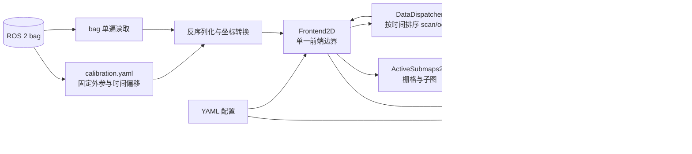

# Cartographer Bag 输入架构

> 文档导航：[首页](README.md) · [入门教程](GETTING_STARTED.md) ·
> [模块索引](MODULES.md) · [配置参考](CONFIGURATION_REFERENCE.md) ·
> [C++ API](API_REFERENCE.md)

## 1. 文档范围

本文描述 SweepNav 当前裁剪版 Cartographer 从 ROS 2 bag 输入到轨迹和 `.swmap`
输出的真实执行链路。它不是上游 Cartographer 的通用架构说明；当前程序只面向：

- 单个 ROS 2 bag；
- 单条新建轨迹；
- 一个 `sensor_msgs/msg/LaserScan` 类型的 `/scan`；
- 一个 `nav_msgs/msg/Odometry` 类型的 `/odom`；
- bag 同目录 `calibration.yaml` 提供的传感器外参；
- 2D 建图，或加载冻结 `.swmap` 后定位。

入口是 `application/bag_runner.cc`，配置入口是
`config/iilabs3d_offline.yaml`。不支持 PointCloud2、MultiEchoLaserScan、GPS、
landmark、fixed-frame 数据和外部 IMU 输入。

## 2. 总体数据流



核心所有权关系是：`SlamSystem` 同时拥有一个 `DataDispatcher`、一个
`TrajectoryBackend2D` 和前端数组。每条轨迹只对应一个 `Frontend2D`。它登记排序回调、
执行局部 SLAM，并把 node/odometry 转交共享的 `TrajectoryBackend2D`，不再经过多层 builder 包装
和虚接口。

```text
SlamSystem
├── DataDispatcher
├── TrajectoryBackend2D（内部单后端 worker）
│   ├── ConstraintEngine2D（内部约束引擎）
│   └── PoseOptimizer2D（内部 Ceres 求解器）
└── Frontend2D[trajectory_id]
    ├── sensor ordering callback
    ├── PoseExtrapolator
    ├── scan matchers
    ├── ActiveSubmaps2D
    └── TrajectoryBackend2D（非拥有指针）
```

## 3. 启动和装配

`bag_runner` 按以下顺序装配系统：

1. 解析命令行参数并读取 YAML；
2. 生成 `SlamSystemOptions` 和 `TrajectoryBuilderOptions`；
3. 校验配置只声明当前支持的输入；
4. 创建 `SlamSystem`；`TrajectoryBackend2D` 同时启动自己的单一串行 worker；
5. 如果指定 `--offline_load_state_filename`，先读取并冻结旧地图；
6. 为 `scan` 和 `odom` 注册一条新轨迹；
7. 创建一个 `Frontend2D` 并注册 scan/odom 排序回调；
8. 加载标定文件，单遍回放传感器数据。

传给 `AddTrajectoryBuilder()` 的 sensor ID 是内部稳定名称 `scan` 和 `odom`。
它们同时也是 `DataDispatcher` 的队列键，不是从 bag 中动态发现的任意话题名称。

### 3.1 模块职责、所有权与依赖

重构后的公开模块、所有权和非拥有依赖如下：

```text
SlamSystem（装配与生命周期容器）
├── owns DataDispatcher                    ← scan/odom 时间排序
├── owns Frontend2D[]            ← 唯一公开 SLAM 前端
└── owns TrajectoryBackend2D               ← 唯一公开 SLAM 后端和串行 worker

Frontend2D
├── borrows DataDispatcher                 ← 注册回调并提交传感器数据
└── borrows TrajectoryBackend2D            ← 提交 node 和 odometry

TrajectoryBackend2D
└── owns one serial backend worker          ← FIFO 后端工作队列
```

`SlamSystem` 是唯一所有者和装配入口；`Frontend2D`、
`TrajectoryBackend2D` 是并列的算法边界。前后端并行指的是 bag 回放和前端继续处理
scan 时，后端 worker 按 FIFO 顺序推进已提交 node 的约束与 PGO；后端内部不并行计算
多个候选。所有 `borrows` 指针都不参与所有权，生命周期由 `SlamSystem` 的成员顺序和
后端队列 fence 保证。

`SlamSystem` 是装配和生命周期入口，本身不执行具体 SLAM 算法。它持有
`TrajectoryBackend2D`、`DataDispatcher` 以及各条 frontend，负责创建轨迹、结束轨迹、
加载/保存 `.swmap`。当前虽然只有一条轨迹，仍由它统一保证这些对象的析构顺序：必须先
等待图计算完成，才能销毁被后台任务引用的 submap、node 和 scan matcher。

`TrajectoryBackend2D` 保存全局状态，包括 trajectory node、submap、约束和优化后的全局位姿。
局部 SLAM 每产生一个 node，`TrajectoryBackend2D` 就为它寻找可匹配的 submap、生成约束，并按
`optimize_every_n_nodes` 触发一次全局优化。局部 scan matching 负责“当前扫描放在哪里”，
TrajectoryBackend2D 则负责“历史 node/submap 整体怎样保持一致并闭环”。

这里的 trajectory、submap 和 node 是三个不同层级：

```text
Trajectory（一次建图或定位会话）
└── Submap（该会话连续生成的局部概率地图）
    └── Node（通过运动过滤并插入地图的激光帧位姿）
```

一个 trajectory 会包含多个 submap，每个 submap 又关联多个 node；不是“每个局部地图算
一条 trajectory”。`NodeId` 和 `SubmapId` 都由 `(trajectory_id, index)` 组成，因此同一
trajectory 内的 node/submap 共享第一个 ID 分量。普通新图模式通常只有 trajectory 0；
加载已知地图定位时，后端同时保存加载并冻结的历史 trajectory 0，以及接收当前 bag 的
活动 trajectory 1。

`ConstraintEngine2D` 和 `PoseOptimizer2D` 是后端私有实现组件：前者生成候选约束，后者
求解已经确定的约束。`SlamSystem`、`Frontend2D`、bag runner 和序列化层都只
依赖 `TrajectoryBackend2D`，不能直接访问这两个组件。这样对外只有一个后端边界，同时
避免把并发任务状态与 Ceres 数值状态混进同一个巨型类。

后端不再使用通用任务 DAG。`TrajectoryBackend2D` 私有的单 worker 依次构建或复用每个
finished submap 的 `FastCorrelativeScanMatcher2D`、计算 node-submap 候选、收集约束并在
达到批次门限时执行 PGO 和 trimmer。耗时工作仍不占用 bag/前端线程，但 matcher 构建、
候选 A、候选 B 和 PGO 之间严格串行。该模型牺牲候选级吞吐，换取确定的执行顺序、简单
的生命周期和更窄的并发边界。

### 3.2 后端线程、回环与 PGO 时序

当前有三种执行上下文，不能把“后端 worker”和“PGO 内部线程”视为同一层：

```text
bag/前端主线程
  └── AddNode / AddOdometryData
        └── 只追加到 TrajectoryBackend2D work queue

TrajectoryBackend2D 单 worker
  ├── FIFO 修改后端图状态
  ├── 同步构建/复用 submap 快速相关匹配器
  ├── 串行计算 node-submap 约束/回环候选
  └── 达到门限后执行 PGO 与 trimmer

PGO：PoseOptimizer2D::Solve
  └── Ceres 求解器线程（ceres_solver_options.num_threads: 7）
```

当前配置的实际并发和候选限流参数是：

- `constraint_builder.sampling_ratio: 0.15`：同轨迹约束候选只抽样约 15%，不是让每个
  node 与所有旧 submap 都匹配；
- `max_constraint_distance: 15.0`：带初值的候选超过 15 m 直接排除；
- 快速相关匹配搜索窗为 `7 m / ±30°`，分支定界深度为 7，得分至少达到 `0.65` 才进入
  后续约束；跨轨迹全局匹配要求 `0.7`；
- `global_sampling_ratio: 0.003`：不同轨迹的全局候选进一步降到约 0.3%；
- 每个候选的 Ceres 精配准使用 `num_threads: 1`，候选之间也严格串行；局部 SLAM 的
  Ceres 同样是单线程；
- PGO 的 Ceres 配置为 `num_threads: 7`，每超过 20 个 node 批量触发一次。

约束阶段的主要并发是“前端主线程 + 一个后端 worker”；PGO 阶段由同一个后端 worker
调用 Ceres，Ceres 内部最多使用 7 线程，同时前端仍可继续处理 bag。PGO 阶段的新 node
只追加到 FIFO 队列，等当前求解和 trimmer 完成后再处理。

前端调用 `AddNode()` 时会先在互斥锁保护下登记 node，然后把“为该 node 建约束”的
work item 放入队列。唯一后端 worker 消费这条队列，因此新增 node、odometry、冻结轨迹、
删除轨迹、约束计算和 PGO 都保持确定顺序。

这里的回环最终表现为 `INTER_SUBMAP` 约束：

- 同一轨迹的 node 与已经结束的旧 submap 做带初值、有限窗口的局部约束搜索；
- 新活动轨迹与冻结地图等不同轨迹之间，在满足时间间隔和采样条件时做全 submap 的全局
  搜索；
- 快速相关匹配先筛选候选，Ceres scan matcher 再细化相对位姿；不同候选按枚举顺序
  串行计算。

回环不是直接建立 submap-submap 边。一个新 node 可以同时对多个已结束 submap 形成候选；
一个 submap 刚结束时，也会反向检查此前未插入该 submap 的旧 node。每个 finished submap
只同步构建一次 `FastCorrelativeScanMatcher2D` 搜索索引，后续候选复用缓存。最终 PGO
通过这些 node-submap 边间接约束 submap 之间的相对位置。

当累计 node 数超过 `optimize_every_n_nodes`（当前配置为 20）时，work queue 暂停继续
处理完当前 node 后，后端直接通过 `ConstraintEngine2D::TakeConstraints()` 取出本批同步
结果，一次性并入后端，再调用 `PoseOptimizer2D::Solve()` 做 PGO，联合优化 submap pose、
node pose 和 odometry 关系。PGO 完成后才更新连通性、执行 trimmer，并继续处理后续
work item。

因此线程关系是：前端与后端异步；后端约束、约束汇总、PGO 和图状态提交全部串行。
bag 主线程在 PGO 期间仍可继续产生局部结果并把 work item 追加到队列，但这些结果要等
当前 PGO 完成后才会进入下一批后端处理。最终 `RunFinalOptimization()` 在 FIFO 中插入
fence，等待此前 work item 和剩余约束全部提交，再完成最终 PGO，保证导出的轨迹和
`.swmap` 已稳定。

### 3.3 `PoseOptimizer2D::Solve()`：装配并求解 2D 位姿图

`ConstraintEngine2D` 负责发现并计算 node-submap 约束，`PoseOptimizer2D::Solve()` 不再
搜索回环或判断约束是否成立。它接收已经确定的约束集，把 submap pose、node pose、
里程计和连续局部 SLAM 关系装配成一个临时 Ceres 问题，联合优化所有可移动的
`[x, y, yaw]`，最后把结果写回长期状态。

```text
当前 submap/node 全局位姿（初值）
              │
              ▼
      创建 Ceres 参数块
              │
      ┌───────┴────────┐
      ▼                ▼
固定坐标基准      添加相对位姿残差
和 frozen 地图    constraint / odometry / local SLAM
      └───────┬────────┘
              ▼
          Ceres Solve
              ▼
写回优化后的 submap/node 全局位姿
```

如果 `node_data_` 为空，函数直接返回。Ceres 的 `Problem`、参数数组和 cost function 都只
服务当前一轮求解；后端长期持有的是 node/submap 状态和约束，不持有跨轮复用的
`ceres::Problem`。

#### 参数块、初值与坐标系基准

`Rigid2d` 先通过 `FromPose()` 转成 Ceres 可原地修改的三元素数组：

```text
Rigid2d → [x, y, yaw]

SubmapId → C_submaps[3]
NodeId   → C_nodes[3]
```

`C_submaps` 和 `C_nodes` 使用当前全局位姿作为初值，并向 Ceres 注册大小为 3 的参数块。
额外建立这两组容器，是为了给求解器提供地址稳定的连续数值内存，同时不在迭代过程中
直接修改后端长期状态。

位姿图主要由相对约束组成。如果所有变量一起平移或旋转，残差不会变化，问题存在三个
平面规范自由度。实现固定遍历到的第一个 submap，把它定义为全局原点和方向，消除秩亏：

```text
T'_global_object = T_offset · T_global_object

对全部 object 使用相同 T_offset 时，相对位姿不变；
固定第一个 submap 后，不再允许整张图任意漂移。
```

此外，状态为 `FROZEN` 的轨迹，其全部 submap 和 node 参数块都设为常量。已知地图定位时，
典型状态是历史 trajectory 0 固定、当前 trajectory 1 可调；因此新定位数据只能调整自身
来贴合已有地图，不能反过来拉动加载的地图。

#### node-submap 约束与鲁棒核

每条 `Constraint` 都建立一个连接 submap 参数块和 node 参数块的三维相对位姿残差：

```text
start_pose = global pose of submap i
end_pose   = global pose of node j
observation = zbar_ij（submap i ← node j）
residual = [weighted error_x, weighted error_y, weighted error_yaw]
```

`SpaCostFunction2D` 先由两个当前全局变量计算预测相对位姿，再与 `zbar_ij` 比较。平移误差
在 start/submap 坐标系中表达，yaw 误差经过角度归一化，然后分别乘
`translation_weight` 和 `rotation_weight`。它使用模板 `operator()`，使 Ceres 可以用
`Jet` 自动求出对两个 `[x, y, yaw]` 参数块的 Jacobian，不需要维护手写导数。

`INTRA_SUBMAP` 表示 node 的数据实际插入过该 submap，是局部建图的结构约束，不加 loss
function。`INTER_SUBMAP` 来自回环或跨轨迹匹配，存在误匹配风险，因此使用
`HuberLoss(huber_scale)`：小残差区域接近平方损失，大残差区域降低增长速度。鲁棒核不会
删除错误边，只会限制异常回环对全局解的支配程度。

#### 连续 node 的里程计与局部 SLAM 约束

除了显式的 node-submap 边，优化器还逐条遍历非 frozen 轨迹，为编号严格连续的 node
建立 node-node 约束。只接受：

```text
second.node_index == first.node_index + 1
```

裁剪可能让 ID 出现空洞，所以不能把当前容器中相邻、但编号不连续的两个 node 当作连续
传感器帧；不同 trajectory 也由 `EndOfTrajectory()` 明确隔开。

如果两个 node 时间都落在里程计数据范围内，`CalculateOdometryBetweenNodes()` 先在两个
时间点分别插值得到 `T_odom_node1` 和 `T_odom_node2`，再构造：

```text
T_node1_node2_odometry = inverse(T_odom_node1) · T_odom_node2
```

并使用 odometry translation/rotation weight 添加一条无鲁棒核的 node-node 残差。无论
里程计是否可用，实现都会再根据前端局部 SLAM 位姿添加：

```text
T_node1_node2_local =
    inverse(T_local_node1) · T_local_node2
```

因此当前逻辑是“有里程计时同时使用 odometry 和 local SLAM；无里程计时只使用 local
SLAM”，不是二选一。冻结轨迹的 node 已设为常量，且整条轨迹会跳过这组连续约束装配。

#### 目标函数、求解与写回

忽略鲁棒核的分段形式后，本轮目标可以概括为：

```text
min  Σ ||node-submap residual||²
   + Σ ||odometry node-node residual||²
   + Σ ||local-SLAM node-node residual||²
```

其中 frozen 参数和第一个 submap 不参与更新，`INTER_SUBMAP` 项额外经过 Huber loss。
`CreateCeresSolverOptions()` 把配置转换为实际迭代次数、线性求解器和线程设置；启用
`log_solver_summary` 时输出初始/最终 cost、迭代次数、收敛状态和耗时。

Ceres 会直接修改 `C_submaps`、`C_nodes` 中的数组。求解完成后，代码用 `ToPose()` 将它们
转换回 `Rigid2d`，写入 `submap_data_.global_pose` 和 `node_data_.global_pose_2d`。后端随后
用这些稳定结果更新公开轨迹、计算 local-to-global 变换、执行下面的 trimmer，并最终输出
轨迹或 `.swmap`。

### 3.4 子图裁剪：定位窗口与重叠地图去冗余

子图裁剪不是从栅格中擦除部分像素，而是从位姿图中移除整个 finished submap，并同步
清理只属于它的 node、相关约束、扫描匹配器缓存和优化变量。后端通过两个接口分离
“决定删谁”和“怎样安全删除”：

```text
PoseGraphTrimmer::Trim()       选择应裁剪的 SubmapId
          │
          ▼
Trimmable::TrimSubmap()        执行位姿图一致性清理
```

`backend_trimmer.h` 定义通用的 `PoseGraphTrimmer` 和 `Trimmable` 接口，并提供
`PureLocalizationTrimmer`；`OverlappingSubmapsTrimmer2D` 则是另一个实现。所有 trimmer
都在一次 PGO 完成、约束和全局位姿稳定之后依次运行。已经完成自身使命的 trimmer 通过
`IsFinished()` 从后端列表移除。

#### 纯定位轨迹：固定子图数量窗口

`PureLocalizationTrimmer` 只处理创建它时指定的活动定位轨迹，不会按窗口裁掉另一条
冻结地图轨迹。定位进行期间，它取得该轨迹按 `SubmapId` 排列的子图序列，删除头部旧
子图，只保留尾部最新的 `max_submaps_to_keep` 个：

```text
max_submaps_to_keep = 3

优化前：S0 S1 S2 S3 S4
裁剪后：      S2 S3 S4
```

这是“子图数量窗口”，不是最近若干秒、若干米，也不比较空间覆盖价值。活动定位子图用于
维持近期 node 的 `INTRA_SUBMAP` 约束和局部连续结构，但它们不是需要永久积累的已知地图，
所以固定小窗口可以限制长期内存和 PGO 规模。轨迹进入 `FINISHED` 后，窗口缩为 0；后续
裁剪删除该定位轨迹的剩余子图，将轨迹标记为 `DELETED`，该 trimmer 随即结束。

#### 建图轨迹：根据优化后的覆盖价值裁剪

`OverlappingSubmapsTrimmer2D` 不采用简单的“只留最后 N 个”规则。旧子图即使时间较早，
只要仍覆盖新子图没有覆盖的区域，就可能具有地图价值。其判定过程分为四步。

第一步是计算子图新鲜度。算法只遍历 `INTRA_SUBMAP` 约束，为每个 `SubmapId` 找到最大
`NodeId`，再读取该 node 的时间戳：

```text
SubmapId → 最后一个实际插入该子图的 NodeId → node.time
```

这里不能使用 `INTER_SUBMAP` 回环约束，因为回环只表示 node 后来与该子图匹配成功，
不表示这帧激光曾参与生成该子图。最后插入时间也比子图创建时间更能表示地图内容更新到
何时。

第二步是建立稀疏的全局覆盖网格。算法只处理存在新鲜度记录且已经
`insertion_finished()` 的子图，遍历每个子图裁剪边界内的已知栅格。每个栅格中心依次做：

```text
cell(local frame)
  ── T_submap_from_local ──→ submap frame
  ── T_global_from_submap ─→ optimized global frame
```

其中 `T_global_from_submap` 必须使用 PGO 后的子图位姿；回环可能已经移动子图，使用优化前
位置会误判真实重叠。投影后的全局 cell 保存覆盖它的 `(SubmapId, freshness)` 列表。
覆盖网格沿用子图分辨率，但它只是重叠统计容器，不是输出概率地图。

第三步是在每个全局 cell 上只承认最新的 `fresh_submaps_count` 个子图。若同一位置被更多
子图覆盖，先按 freshness 降序排序，再忽略较旧覆盖；随后为仍被承认的每个子图累计一个
有效 cell：

```text
某 cell 被 S1(old)、S2、S3(new) 覆盖，fresh_submaps_count = 2
有效覆盖计数：S2 +1，S3 +1；S1 在该 cell 不计数
```

这一步不会立即删除 S1，只表示该位置已有足够多更新的地图层，S1 在这里不再贡献独立
保留价值。遍历全部 cell 后，算法得到每个子图经过新鲜度过滤后仍然有效的覆盖面积。

第四步把面积门限转换成 cell 数量：

```text
cell_area = resolution²
min_covered_cells_count = min_covered_area / resolution²
```

有效 cell 数少于该门限的子图进入删除集合。最终结果用
`all_submap_ids - submap_ids_to_keep` 求得，因此完全没有获得有效 cell 的参与子图也会被
裁剪。三个参数分别控制：

| 参数 | 含义 | 增大后的效果 |
|---|---|---|
| `fresh_submaps_count` | 每个位置允许保留的最新覆盖层数 | 旧子图更容易继续获得有效 cell，裁剪更保守 |
| `min_covered_area` | 子图继续保留所需的最低有效面积 | 更多低独立覆盖子图被裁掉，裁剪更激进 |
| `min_added_submaps_count` | 两次覆盖重算之间至少新增的子图数 | 降低裁剪计算频率和 CPU，但冗余保留更久 |

覆盖计算需要遍历所有参与子图的已知栅格，代价明显高于固定窗口。因此
`current_submap_count_` 记录上次裁剪后的数量；新增量没有超过
`min_added_submaps_count` 时直接返回，避免每次 PGO 都重建覆盖网格。

#### `TrimSubmap()` 的一致性边界

两种策略最终都调用同一个 `TrajectoryBackend2D::TrimmingHandle::TrimSubmap()`。它只接受
`kFinished` 子图，并按以下顺序维护位姿图一致性：

1. 找出该子图关联、同时又被其他子图引用的 node，保留这些共享 node；
2. 找出只属于待删子图的 node；
3. 删除指向待删子图的全部约束，并删除指向专属 node 的其他约束；
4. 清理不再需要的 `FastCorrelativeScanMatcher2D` 缓存和 per-submap sampler；
5. 从后端子图容器和 `PoseOptimizer2D` 中移除子图；
6. 从轨迹 node 容器、里程计历史和优化问题中移除专属 node。

`SubmapId` 和 `NodeId` 的编号不会重新压缩，剩余对象仍保持原 ID。裁剪会改变后续可参与
回环和 PGO 的图规模，属于有算法效果的资源管理策略；调整参数时应同时观察内存、约束
候选数、PGO 时间和轨迹精度，不能只验证程序能否运行。

### 3.5 `MaybeAddConstraint()` 的同步候选流水线

`ConstraintEngine2D::MaybeAddConstraint()` 处理的是“已有相对位姿初值”的
node-submap 局部约束候选。它运行在唯一后端 worker 上，依次完成前置筛选、matcher
获取、粗匹配和精化；函数返回时该候选已经成功加入结果集或明确失败。

#### 第一层：初值距离门限

`initial_relative_pose` 是 node 相对 submap 的平面位姿初值。它通常来自当前
node/submap 全局位姿估计的相对变换，并决定快速相关匹配的搜索中心。
函数首先检查其平移模长：

```text
norm(initial_relative_pose.translation) > max_constraint_distance
                                      → 直接丢弃
```

当前 `max_constraint_distance` 为 15 m。这一层不读取栅格、不构建匹配索引，
用最小成本排除超过带初值局部搜索适用范围的候选。这里只检查平移距离；
yaw 差由后续相关搜索窗和匹配得分共同限制。

#### 第二层：每个 submap 独立的固定比例采样

`per_submap_sampler_` 的逻辑键值是：

```text
SubmapId → FixedRatioSampler(sampling_ratio)
```

`emplace(std::piecewise_construct, ...)` 使第一个属于该 submap 的候选创建
sampler，后续候选复用同一个计数器。`Pulse()` 每次先增加 pulse 数，仅当

```text
num_samples / num_pulses < sampling_ratio
```

时放行当前候选并增加 sample 数。因此它不是伪随机数比较，而是确定性的
均匀固定比例抽样；在相同候选调用顺序下会产生相同选择。当前
`sampling_ratio=0.15`，表示每个 submap 长期约有 15% 的近距离候选进入真正
扫描匹配。按 submap 分开计数可防止候选密集的 submap 消耗全局采样额度。

所以 `sampling_ratio` 的分母不是全部 LaserScan，而是已通过距离门限、
且属于同一 submap 的 node-submap 候选对：

```text
全部 node-submap 组合
  → max_constraint_distance 筛选
  → per-submap FixedRatioSampler
  → 真正执行局部约束匹配
```

#### 第三层：同步惰性构建 scan matcher

候选通过后，`GetOrCreateScanMatcher(submap_id, submap->grid())` 按 submap 查找缓存。
第一次使用时就在后端 worker 上同步构建 `FastCorrelativeScanMatcher2D`；submap 的概率
栅格一旦 finished 就不再变化，因此昂贵的多分辨率索引只构建一次，之后由该 submap 的
所有 node 候选复用。函数返回时 matcher 一定可用，不存在 creation handle 或生命周期
跨任务问题。

#### 第四层：同步计算并收集结果

`ComputeConstraint(..., match_full_submap=false, ...)` 使用
`initial_relative_pose` 执行有限窗局部搜索；`MaybeAddGlobalConstraint()` 传入 `true`
并搜索完整 submap。快速相关匹配低于阈值时返回 `std::nullopt`；成功时用 Ceres scan
matcher 精化并返回 `Constraint`。调用方只把成功结果按候选枚举顺序追加到
`std::vector<Constraint>`：

```text
distance filter
  → per-submap sampler
  → GetOrCreateScanMatcher（同步）
  → ComputeConstraint（同步）
  → optional<Constraint>
  → pending constraints
```

达到 PGO 门限时，后端 worker 调用 `TakeConstraints()` 交换出当前结果向量，然后立即
进入 `PoseOptimizer2D::Solve()`。由于 matcher、候选和结果收集都在同一个线程按程序顺序
完成，原来的 `finish_node_task_`、`when_done_task_`、空结果槽、依赖计数和 callback 均已
删除。最终等待同样只需在 FIFO 中插入 fence；fence 执行即证明此前全部后端工作完成。

## 4. Bag 单遍读取

每个源 bag 目录固定保存自己的 `calibration.yaml`。benchmark worker 生成只包含
`/scan` 和 `/odom` 的规范化 `native_input` bag，并把源标定文件原样复制到同目录，
不在运行时推导或改写标定。IILABS3D 的 odometry child frame 已经是配置的
`tracking_frame`（`eve/base_footprint`），因此对应外参为单位矩阵。

`bag_runner` 启动时读取一次标定文件，然后只打开一个 `rosbag2_cpp::Reader`：

- `/scan`：反序列化 LaserScan，过滤非有限值和量程外点，把极坐标转为带点内相对
  时间的点云，再用 `T_tracking_sensor` 变换到 `tracking_frame`，形成
  `TimedPointCloudData`；
- `/odom`：校验 reference/child frame，再用 `T_tracking_child` 把 pose 统一到
  tracking frame，形成 `OdometryData`；
- 其他话题：忽略。

标定文件采用 `T_parent_child` 约定，即矩阵把 child 坐标表达转换为 parent 坐标表达；
同时记录 schema、单位、topic、消息类型、frame、pose 约定及传感器时间偏移。矩阵使用
OpenVINS 风格的 4×4 齐次形式。runner 会检查矩阵末行、旋转正交性、行列式和消息中的
frame，避免方向写反或标定与 bag 不匹配。

LaserScan 的数据时间定义为最后一个有效扫描点所在时刻；各点的时间改写为相对该时刻
的非正偏移。这是后续运动补偿和 pose extrapolation 的时间基准。

## 5. 时间排序与分派

`Frontend2D` 把两种强类型数据直接提交给 `DataDispatcher`。
dispatcher 使用 C++20 `std::variant<TimedPointCloudData, OdometryData>` 保存数据，
为 `(trajectory_id, sensor_id)` 各维护一个无锁 `std::deque`，并保证：

- scan 和 odom 按数据时间全局递增分派；
- 两个传感器都到达共同起始时间之前，不提前释放不确定顺序的数据；
- 单个队列缺数据时暂停分派；
- `FinishTrajectory()` 标记所有队列结束并排空剩余数据。

排序后的数据通过 `std::visit` 进入 `Frontend2D::ProcessSensorData()` 的强类型
重载，不再创建 `sensor::Data` 虚对象，也不经过 builder 虚接口、`BlockingQueue` 或
`OrderedMultiQueue`。bag 文件中消息的物理排列可以交错，但每个
传感器自身仍必须保持时间有序。当前 bag reader 是唯一生产者，后台 TrajectoryBackend2D 不会写
传感器队列，因此 dispatcher 明确采用单线程同步模型。

## 6. `/scan` 的局部 SLAM 路径

一次 scan 进入 `Frontend2D` 后，由内部局部匹配实现依次经过：

1. 校验输入是唯一的 `scan` sensor，且帧内点时间单调递增；
2. `PoseExtrapolator` 根据已有 pose 和 odometry 预测扫描期间姿态；
3. 把逐点数据变换到重力对齐坐标系并做距离过滤；
4. 按配置累积若干帧并做 voxel filtering；
5. 用预测位姿作为 scan matching 初值；
6. 可选实时相关匹配产生较稳健的粗位姿；
7. Ceres scan matcher 对当前活动子图做精配准；
8. motion filter 判断此次结果是否值得插入；
9. 将 range data 插入 `ActiveSubmaps2D`；
10. 返回 `MatchingResult`，插入成功时同时返回节点数据和关联子图。

局部 SLAM 输出的是 `local` 坐标系下的连续位姿。它不会直接修改全局优化结果。

### 6.1 PoseExtrapolator 的预测原理

一帧 LaserScan 不是瞬时拍摄：每个点带有相对帧末时间 `δtᵢ ≤ 0`。机器人在扫描
期间仍然运动，如果把所有点都当成帧末同一姿态采集，墙面会被拉弯或重影。
`PoseExtrapolator` 的首要用途就是为每个点计算采样时刻
`tᵢ = t_scan_end + δtᵢ` 的预测位姿，完成逐点运动补偿（deskew）。

预测器维护一个短时 pose 队列，队列中的 pose 是此前 scan matching 已经校正过的局部
位姿。初始化时在第一帧 scan 的结束时间加入单位位姿。此后每次 scan matching 成功，
新的 `pose_estimate` 都通过 `AddPose()` 反馈进队列，重新估计速度。

速度来源有优先级：

1. 至少有两条 odometry 时，用最早和最新 odometry 的相对变换估计 tracking frame 下
   的线速度与角速度；
2. odometry 尚不足两条时，用 pose 队列首尾两个已匹配位姿的差分速度；
3. 初始化阶段还没有足够时间跨度时，速度保持零，预测位姿等于最近位姿。

对最近校正位姿 `T_local_tracking(t₀) = (yaw₀, p₀)` 和时间差
`Δt = t - t₀`，实现采用平面恒速模型：

```text
p(t)   = p₀ + v · Δt
yaw(t) = normalize(yaw₀ + ω · Δt)
```

其中 `v` 和 `ω` 优先取 odometry 差分结果。里程计输入在 ROS 边界只提取
`x/y/yaw`，不再构造合成 IMU 或 gravity alignment。

因此每个点使用的都是包含位置和朝向的
`T_local_tracking(tᵢ) = (R(tᵢ), p(tᵢ))`：

```text
p_local(tᵢ) = T_local_tracking(tᵢ) · p_tracking(tᵢ)
```

这里先在 `local` 坐标系完成逐点 deskew，是因为不同采样时刻的 tracking frame 在运动，
而 local frame 是这一小段时间内共同的静止参考。随后以扫描帧末姿态为基准，把累计点云
变换到帧末 tracking 坐标系：

```text
T_tracking_end_local = inverse(T_local_tracking(t_end))
p_tracking_end       = T_tracking_end_local · p_local
```

点云坐标仍用 `Vector3f` 容纳 z 值，但用来 deskew 的位姿始终是
`x/y/yaw`；三维点只是数据载体，不是定位状态。

预测有两个消费位置：

- 对 scan 内每个点调用 `ExtrapolatePose(tᵢ)`，把点和雷达原点变换到运动补偿后的
  local 坐标；
- 对帧末调用 `ExtrapolatePose(t_scan_end)`，直接作为 scan matcher 的搜索
  初值。

它不是最终位姿来源。最终局部位姿由 scan matcher 对活动子图校正：

```text
上一帧匹配的 Rigid3 位姿 + odometry 线/角速度积分
                  ↓
           scan matching 初值
                  ↓
       子图观测校正后的 pose_estimate
                  ↓
         回写 PoseExtrapolator
```

因此 odometry 短时稳定时可缩小匹配搜索范围；odometry 有累计漂移时，激光与子图匹配会
持续校正局部预测，而后端 TrajectoryBackend2D 再负责更长时间尺度的回环和全局一致性。

## 7. `/odom` 的双路径

Odometry 经 `Frontend2D` 后分成两路：

- 送入前端内部的局部匹配实现，供 `PoseExtrapolator` 做实时姿态预测；
- 送入 `TrajectoryBackend2D` 保存为全局优化的 odometry 约束数据。

第二路可以由 `pose_graph_odometry_motion_filter` 降采样。当前没有外部 IMU 输入；局部
位姿外推只使用 odometry 或已估计 pose 的平面线速度和 yaw 角速度。

## 8. 从局部结果到 TrajectoryBackend2D

`Frontend2D` 是唯一的前端入口，也是前端与后端的边界：

- 只有产生 `MatchingResult` 的 scan 才形成一次局部 SLAM 输出；
- 只有通过 motion filter、带 `InsertionResult` 的结果才调用
  `TrajectoryBackend2D::AddNode()`；
- 新节点携带常量观测数据和其插入的一个或多个子图；
- TrajectoryBackend2D 立即建立 intra-submap 约束，并在后台搜索 inter-submap/回环约束；
- 达到配置的节点数后触发一次全局优化。

`ConstraintEngine2D` 使用快速相关扫描匹配器寻找候选，再用 Ceres 细化约束。
`PoseOptimizer2D` 联合优化节点位姿、子图位姿和 odometry 关系。优化完成后执行
trimmer，删除定位模式下不再需要保留的旧子图。

### 8.1 待办：面向在线部署的高频平滑位姿输出

当前 `bag_runner` 面向离线处理：任务结束后遍历通过 motion filter 的稀疏 node，导出其
PGO 优化位姿到 `trajectory.csv`。benchmark 再把这些 node 插值到真值时间点，只用于评估
对齐；这不是机器人运行时的定位发布协议。当前工程也没有 IMU 输入或固定频率定位发布器。

在线定位不应等待下一轮 PGO，也不应把稀疏优化 node 直接当作控制频率输出。计划增加一个
独立输出层，以最新后端优化结果作为低频全局锚点，以前端局部位姿和 odometry 外推作为
高频连续增量：

```text
最新已优化 node k：
T_map_local = T_map_node_k(optimized) · inverse(T_local_node_k)

任意输出时刻 t：
T_map_base(t) = T_map_local · T_local_base(t, extrapolated)
```

其中 `T_local_base(t)` 复用前端“最近一次 scan matching 校正位姿 + 后续 odometry 增量”
的短时预测能力。激光匹配仍按 scan 累积频率更新局部锚点，PGO 仍按约束批次更新全局
锚点，而对外发布可以由独立定时器按 Nav2/控制所需频率执行；三种频率不要求相同。

ROS 部署优先采用标准双层 TF 职责：

```text
map  ── SLAM/PGO 低频全局修正 ──> odom
odom ── 里程计或局部状态估计 ──> base_link

T_map_base = T_map_odom · T_odom_base
```

`odom → base_link` 应高频、连续、短期平滑，允许长期漂移；`map → odom` 负责回环、重定位
和长期漂移修正。这样控制器和局部规划可在连续的 odom frame 工作，全局规划仍使用 map
frame。若产品要求视觉上平滑 PGO 跳变，只能在发布层对旧、新 `map → odom` 做有界过渡，
不能把平滑中的临时位姿反馈为 SLAM 观测；大幅重定位还应允许直接切换并通知下游。

该待办与 `PoseOptimizer2D::InterpolateOdometry()` 必须保持职责隔离：后者只在 PGO 中把
历史 odometry 对齐到两个稀疏 node 的时间戳，用于构造 node-node 相对约束；它不是实时
融合滤波器，也不决定定位发布频率。

实施前需要明确并验证：

1. 由 `SlamSystem` 或新的窄接口暴露最新 `local_to_global` 锚点和按时间外推的 local pose；
2. 规定 scan callback 输出、固定频率 TF 输出和离线优化轨迹三者的时间戳及状态语义；
3. 定义 PGO/重定位跳变时 `map → odom` 的切换策略和下游通知；
4. 对延迟、最大外推时长、odometry 中断和时间倒退设置硬边界，禁止无限外推；
5. 增加在线回放测试，分别检查静止抖动、运动连续性、PGO 前后全局一致性及 TF 连通性。

本阶段只记录架构方向，不在离线 Cartographer 核心中提前实现 ROS timer、TF 发布或新的
融合滤波器。

## 9. 建图与冻结地图定位

### 9.1 新图模式

不传 `--offline_load_state_filename` 时，TrajectoryBackend2D 从空状态开始。新轨迹持续创建节点和
子图，结束后完整优化，并可输出新的 `.swmap`。

### 9.2 已知地图定位模式

传入 `.swmap` 时，`SlamSystem::LoadStateFromFile()`：

1. 校验并读取当前 v4 schema；
2. 为文件中的轨迹创建新的内部 trajectory ID；
3. 恢复子图、节点和 intra-submap 关系；
4. 把恢复的轨迹标记为 frozen；
5. 另建一条活动轨迹接收当前 bag 的 scan/odom；
6. 通过新节点到冻结子图的约束完成定位。

当前原生加载只允许 frozen map，不支持继续修改已加载的历史轨迹。

如果调用方已知新旧轨迹的初始坐标关系，后端可使用
`InitialTrajectoryPoseState{to_trajectory_id, relative_pose, time}`：

- `to_trajectory_id` 是参考轨迹，例如冻结地图 trajectory 0；
- `relative_pose` 是新轨迹相对参考轨迹的初始刚体变换；
- `time` 指明应查询参考轨迹 global pose 的时刻。

可把初始 global 关系理解为：

```text
T_global_new(t) = T_global_reference(t) · T_reference_new · T_new_local(t)
```

它只是两条轨迹坐标系之间的初始对齐，不会把活动轨迹永久固定；后续新 node 与冻结
submap 的约束仍可修正定位轨迹。不加载地图的单轨迹建图不需要这一关系。

### 9.3 已知地图定位的候选约束减负项

当前已知地图模式仍为活动 trajectory 创建 node 和 submap。这些活动 submap
对前端局部扫描匹配是必要的：它们提供连续、小范围的局部参考，避免每帧
扫描都直接搜索冻结大地图。但当前后端没有区分“冻结地图定位目标”和
“活动轨迹历史回环目标”：`ComputeConstraintsForNode()` 会收集所有 finished
submap，因此定位阶段实际同时运行两类额外约束：

```text
活动 node
  ├── 对活动 trajectory 自己的 finished submap
  │     → 原有轨迹内 inter-submap 回环
  │
  └── 对冻结 trajectory 的 finished submap
        → 定位所需的跨轨迹约束
```

相比单轨迹建图，定位模式既保留了原有轨迹内回环，又增加了活动 node
与冻结地图 submap 的候选组合。跨轨迹尚未连接时，后者按
`global_sampling_ratio` 执行完整 submap 搜索；建立连接后，会改为带初值的
距离过滤和 `sampling_ratio` 局部搜索。因此全局匹配不是每帧发生，但大型
冻结地图附近仍可产生较多局部候选。

纯定位的目标结构应为：

```text
活动 trajectory
  ├── 保留 2～3 个滚动 submap，服务前端局部匹配
  ├── 保留 node 到当前插入 submap 的 INTRA_SUBMAP 约束
  ├── 禁止 node 对自身 finished submap 的额外历史回环
  ├── 只将冻结地图 submap 作为长期定位目标
  └── 及时裁剪过期活动 submap/node
```

建议按以下顺序实施：

1. **先限制活动子图数量**：定位轨迹启用
   `pure_localization_trimmer.max_submaps_to_keep=3`。这可限制长期内存和 PGO 规模，
   但 trimmer 在约束批次汇合后才执行，不能消除裁剪前已经调度的自身回环。
2. **过滤活动轨迹自身回环**：在定位模式的 finished-submap 候选枚举中，
   跳过 `node_id.trajectory_id == submap_id.trajectory_id` 的额外
   `INTER_SUBMAP` 搜索。不得删除节点向当前滚动 submap 插入时直接建立的
   `INTRA_SUBMAP` 约束。
3. **减少冻结地图候选枚举**：稳定连接后，按 submap 全局包围盒或空间索引
   先查询初值附近的冻结 submap，再进入 `max_constraint_distance` 和比例采样。
   未建立跨轨迹连接时仍保留低频全局重定位，避免失去绑架恢复能力。

该优化会改变约束集、PGO 变量的有效连接方式和定位轨迹，不能当作纯性能
重构。验收时必须分别记录：每 node 枚举/采样/实际匹配的同轨迹与跨轨迹
候选数、constraint worker CPU 时间、峰值内存、PGO 时间，并重跑六条真实 bag、
known-map smoke 与轨迹 SHA-256 差异分析。性能下降不能以放宽 ATE/AOE/RPE 门限换取。

### 9.4 Submap 状态与约束搜索资格

后端的 `SubmapState` 不是完整生命周期枚举，而是描述 submap 能否作为额外约束搜索目标：

```cpp
enum class SubmapState { kNoConstraintSearch, kFinished };
```

状态变化如下：

```text
创建并持续插入 scan
      │
      ▼
kNoConstraintSearch
      │ 达到 num_range_data，概率栅格不再变化
      ▼
kFinished
      ├── 构建 FastCorrelativeScanMatcher2D 索引
      ├── 接受额外 node-submap 回环搜索
      └── 参与后续 PGO 和裁剪
```

`kNoConstraintSearch` 不等于“没有任何约束”。活动 submap 仍会与正在插入它的 node 建立
确定的 intra-submap 插入约束；禁止的是把这个仍在变化的栅格当作历史目标，执行额外的
inter-submap/回环搜索。否则每次插入 scan 都可能使已经构建的快速相关匹配索引失效。

`kFinished` 只表示地图内容已固定、具备搜索资格，不表示后端工作全部结束；索引构建、
候选验证、PGO 和 trimmer 仍可能异步发生。从 `.swmap` 加载的历史 submap 会恢复为
finished submap，并非“已经加载但因生命周期策略保持禁止搜索”。

## 10. 结束、优化与输出

bag 读完后的顺序不可交换：

1. `SlamSystem::FinishTrajectory()` 结束并排空 sensor queues；
2. `TrajectoryBackend2D::FinishTrajectory()` 标记轨迹完成；
3. `TrajectoryBackend2D::RunFinalOptimization()` 等待后台约束任务并做最终全局优化；
4. 从 `GetTrajectoryNodes()` 写优化后的 `timestamp,x,y,theta` CSV；
5. 可选调用 `SerializeStateToFile(true, ...)` 写 `.swmap`。

`.swmap` 由 `serialization/swmap.*` 负责，保存轨迹 ID、子图栅格、节点和约束。
它是持久化边界，不拥有运行时 TrajectoryBackend2D 状态。

## 11. 线程和阻塞边界

- bag 读取、消息反序列化、标定变换、`DataDispatcher` 分派和局部 SLAM 在主线程推进；
- TrajectoryBackend2D 通过私有单 worker 串行计算候选约束；
- TrajectoryBackend2D 的 work queue 串行化会修改全局图状态的操作；
- `RunFinalOptimization()` 是最终同步屏障，返回后才能导出稳定轨迹和地图；
- `DataDispatcher` 若等待某个 sensor queue，会停止整个轨迹的数据分派，因此缺失 `/scan` 或
  `/odom` 不能被当作可选输入。

## 12. 目录与职责对应

| 目录 | 在 bag 链路中的职责 |
|---|---|
| `application/` | `SlamSystem` 装配、bag 单遍读取、ROS 消息转换和生命周期控制 |
| `foundation/` | 时间、几何、传感器值类型、体素过滤和运行统计 |
| `frontend/` | 数据排序、单一前端、局部 SLAM、姿态预测和运动过滤 |
| `application/` | bag 入口、系统装配、配置解析和 SLAM 参数 |
| `backend/` | 轨迹状态、约束、优化、历史数据和异步任务执行 |
| `scan_matching/` | 局部匹配及全局约束搜索使用的匹配算法 |
| `mapping/` | 栅格、子图及其插入生命周期 |
| `backend/` | 节点/子图约束、回环、全局优化与裁剪 |
| `serialization/` | `.swmap` v4 平面位姿读写 |

新增代码应按主要状态所有权落位，不应重新建立 `slam/` 汇总目录，也不应创建超过
`cartographer/<职责>/<文件>` 的源码层级。

## 13. 关键入口索引

| 入口 | 文件 |
|---|---|
| bag 主流程 | `application/bag_runner.cc` |
| 栈装配与状态加载 | `application/slam_system.cc` |
| 时间排序 | `frontend/data_dispatcher.cc` |
| 单一前端与前后端桥接 | `frontend/frontend_2d.{h,cc}` |
| 局部 SLAM | `frontend/local_slam_2d.cc` |
| 子图和栅格 | `mapping/submap_2d.cc`、`mapping/grid_2d.cc` |
| 单一后端入口与工作流 | `backend/trajectory_backend_2d.{h,cc}` |
| 后端只读查询 | `backend/trajectory_backend_query_2d.cc` |
| 内部约束引擎 | `backend/constraint_engine_2d.{h,cc}` |
| 内部位姿优化器 | `backend/pose_optimizer_2d.{h,cc}` |
| 约束计算 | `backend/constraint_engine_2d.cc` |
| 全局优化 | `backend/pose_optimizer_2d.cc` |
| 状态持久化 | `serialization/swmap.cc` |
