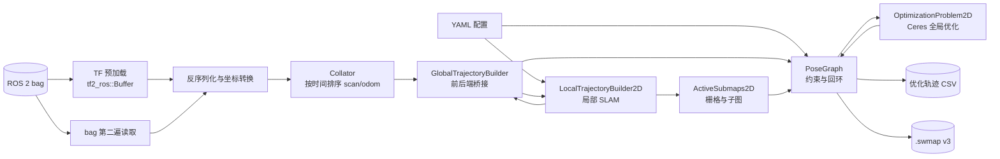

# Cartographer Bag 输入架构

## 1. 文档范围

本文描述 SweepNav 当前裁剪版 Cartographer 从 ROS 2 bag 输入到轨迹和 `.swmap`
输出的真实执行链路。它不是上游 Cartographer 的通用架构说明；当前程序只面向：

- 单个 ROS 2 bag；
- 单条新建轨迹；
- 一个 `sensor_msgs/msg/LaserScan` 类型的 `/scan`；
- 一个 `nav_msgs/msg/Odometry` 类型的 `/odom`；
- `/tf` 和 `/tf_static` 提供的坐标变换；
- 2D 建图，或加载冻结 `.swmap` 后定位。

入口是 `application/bag_runner.cc`，配置入口是
`config/iilabs3d_offline.yaml`。不支持 PointCloud2、MultiEchoLaserScan、GPS、
landmark、fixed-frame 数据和外部 IMU 输入。

## 2. 总体数据流



核心所有权关系是：`MapBuilder` 同时拥有线程池、一个 `Collator`、一个
`PoseGraph` 和轨迹构建器数组。每条轨迹构建器实际是一层
`CollatedTrajectoryBuilder`，内部包装一层 `GlobalTrajectoryBuilder`，后者再拥有
`LocalTrajectoryBuilder2D`，并持有共享 `PoseGraph` 的非拥有指针。

```text
MapBuilder
├── ThreadPool
├── Collator
├── PoseGraph
│   ├── ConstraintBuilder2D
│   └── OptimizationProblem2D
└── CollatedTrajectoryBuilder[trajectory_id]
    └── GlobalTrajectoryBuilder
        └── LocalTrajectoryBuilder2D
            ├── PoseExtrapolator
            ├── RangeDataCollator
            ├── scan matchers
            └── ActiveSubmaps2D
```

## 3. 启动和装配

`bag_runner` 按以下顺序装配系统：

1. 解析命令行参数并读取 YAML；
2. 生成 `MapBuilderOptions` 和 `TrajectoryBuilderOptions`；
3. 校验配置只声明当前支持的输入；
4. 创建 `MapBuilder`、后台线程池和 `PoseGraph`；
5. 如果指定 `--offline_load_state_filename`，先读取并冻结旧地图；
6. 为 `scan` 和 `odom` 注册一条新轨迹；
7. 创建 `CollatedTrajectoryBuilder → GlobalTrajectoryBuilder →
   LocalTrajectoryBuilder2D` 链路；
8. 预载 TF，再开始传感器数据回放。

传给 `AddTrajectoryBuilder()` 的 sensor ID 是内部稳定名称 `scan` 和 `odom`。
它们同时也是 Collator 的队列键，不是从 bag 中动态发现的任意话题名称。

## 4. Bag 两遍读取

### 4.1 第一遍：预载坐标变换

`PreloadTransforms()` 只读取 `/tf` 和 `/tf_static`，统一去掉 frame 名开头的
`/`，然后写入 `tf2_ros::Buffer`。之所以先完整预载，是为了让第二遍处理任意时间戳
的 scan 和 odometry 时都能同步查询传感器坐标系到 `tracking_frame` 的变换。

这一遍不向 SLAM 栈提交传感器数据。

### 4.2 第二遍：回放传感器数据

第二个 `rosbag2_cpp::Reader` 按 bag 顺序读取消息：

- `/scan`：反序列化 LaserScan，过滤非有限值和量程外点，把极坐标转为带点内相对
  时间的点云，再变换到 `tracking_frame`，形成 `TimedPointCloudData`；
- `/odom`：反序列化 Odometry，用 `child_frame_id → tracking_frame` 的 TF 修正
  pose，形成 `OdometryData`；
- 其他话题：忽略。

LaserScan 的数据时间定义为最后一个有效扫描点所在时刻；各点的时间改写为相对该时刻
的非正偏移。这是后续运动补偿和 pose extrapolation 的时间基准。

## 5. 时间排序与分派

`CollatedTrajectoryBuilder` 把两种强类型数据包装成 `sensor::Data`，提交给
`Collator`。`Collator` 为 `(trajectory_id, sensor_id)` 各维护一个队列，并保证：

- scan 和 odom 按数据时间全局递增分派；
- 两个传感器都到达共同起始时间之前，不提前释放不确定顺序的数据；
- 单个队列缺数据时暂停分派；
- `FinishTrajectory()` 标记所有队列结束并排空剩余数据。

排序后的数据通过虚分派重新进入 `GlobalTrajectoryBuilder::AddSensorData()`。bag 文件中
消息的物理排列可以交错，但每个传感器自身仍必须保持时间有序。

## 6. `/scan` 的局部 SLAM 路径

一次 scan 进入 `LocalTrajectoryBuilder2D::AddRangeData()` 后依次经过：

1. `RangeDataCollator` 汇聚当前 range sensor 数据；
2. `PoseExtrapolator` 根据已有 pose 和 odometry 预测扫描期间姿态；
3. 把逐点数据变换到重力对齐坐标系并做距离过滤；
4. 按配置累积若干帧并做 voxel filtering；
5. 用预测位姿作为 scan matching 初值；
6. 可选实时相关匹配产生较稳健的粗位姿；
7. Ceres scan matcher 对当前活动子图做精配准；
8. motion filter 判断此次结果是否值得插入；
9. 将 range data 插入 `ActiveSubmaps2D`；
10. 返回 `MatchingResult`，插入成功时同时返回节点数据和关联子图。

局部 SLAM 输出的是 `local` 坐标系下的连续位姿。它不会直接修改全局优化结果。

## 7. `/odom` 的双路径

Odometry 经 `GlobalTrajectoryBuilder` 后分成两路：

- 送入 `LocalTrajectoryBuilder2D`，供 `PoseExtrapolator` 做实时姿态预测；
- 送入 `PoseGraph` 保存为全局优化的 odometry 约束数据。

第二路可以由 `pose_graph_odometry_motion_filter` 降采样。当前没有外部 IMU 输入；局部
姿态推演使用 odometry、已估计 pose 的角速度以及内部合成重力方向。

## 8. 从局部结果到 PoseGraph

`GlobalTrajectoryBuilder` 是前端与后端的边界：

- 只有产生 `MatchingResult` 的 scan 才形成一次局部 SLAM 输出；
- 只有通过 motion filter、带 `InsertionResult` 的结果才调用
  `PoseGraph::AddNode()`；
- 新节点携带常量观测数据和其插入的一个或多个子图；
- PoseGraph 立即建立 intra-submap 约束，并在后台搜索 inter-submap/回环约束；
- 达到配置的节点数后触发一次全局优化。

`ConstraintBuilder2D` 使用快速相关扫描匹配器寻找候选，再用 Ceres 细化约束。
`OptimizationProblem2D` 联合优化节点位姿、子图位姿和 odometry 关系。优化完成后执行
trimmer，删除定位模式下不再需要保留的旧子图。

## 9. 建图与冻结地图定位

### 9.1 新图模式

不传 `--offline_load_state_filename` 时，PoseGraph 从空状态开始。新轨迹持续创建节点和
子图，结束后完整优化，并可输出新的 `.swmap`。

### 9.2 已知地图定位模式

传入 `.swmap` 时，`MapBuilder::LoadStateFromFile()`：

1. 校验并读取当前 v3 schema；
2. 为文件中的轨迹创建新的内部 trajectory ID；
3. 恢复子图、节点、轨迹数据和 intra-submap 关系；
4. 把恢复的轨迹标记为 frozen；
5. 另建一条活动轨迹接收当前 bag 的 scan/odom；
6. 通过新节点到冻结子图的约束完成定位。

当前原生加载只允许 frozen map，不支持继续修改已加载的历史轨迹。

## 10. 结束、优化与输出

bag 读完后的顺序不可交换：

1. `MapBuilder::FinishTrajectory()` 结束并排空 sensor queues；
2. `PoseGraph::FinishTrajectory()` 标记轨迹完成；
3. `PoseGraph::RunFinalOptimization()` 等待后台约束任务并做最终全局优化；
4. 从 `GetTrajectoryNodes()` 写优化后的 `timestamp,x,y,theta` CSV；
5. 可选调用 `SerializeStateToFile(true, ...)` 写 `.swmap`。

`.swmap` 由 `serialization/swmap.*` 负责，保存轨迹、子图栅格、节点、约束和轨迹
数据。它是持久化边界，不拥有运行时 PoseGraph 状态。

## 11. 线程和阻塞边界

- bag 读取、消息反序列化、TF 查询、Collator 分派和局部 SLAM 在主线程推进；
- PoseGraph 通过 `ThreadPool` 并行计算候选约束；
- PoseGraph 的 work queue 串行化会修改全局图状态的操作；
- `RunFinalOptimization()` 是最终同步屏障，返回后才能导出稳定轨迹和地图；
- Collator 若等待某个 sensor queue，会停止整个轨迹的数据分派，因此缺失 `/scan` 或
  `/odom` 不能被当作可选输入。

## 12. 目录与职责对应

| 目录 | 在 bag 链路中的职责 |
|---|---|
| `application/` | 参数、bag 两遍读取、ROS 消息转换、生命周期控制 |
| `core/` | 时间、传感器数据、Collator、点云、变换、线程池和指标 |
| `trajectory/` | 数据排序外壳以及局部/全局轨迹编排边界 |
| `local/` | 局部 SLAM、姿态预测、运动过滤和 range 汇聚 |
| `scan_matching/` | 局部匹配及全局约束搜索使用的匹配算法 |
| `mapping/` | MapBuilder、栅格和子图生命周期 |
| `pose_graph/` | 节点/子图约束、回环、全局优化与裁剪 |
| `serialization/` | `.swmap` v3 读写 |

新增代码应按主要状态所有权落位，不应重新建立 `slam/` 汇总目录，也不应创建超过
`cartographer/<职责>/<文件>` 的源码层级。

## 13. 关键入口索引

| 入口 | 文件 |
|---|---|
| bag 主流程 | `application/bag_runner.cc` |
| 栈装配与状态加载 | `mapping/map_builder.cc` |
| 时间排序 | `core/collator.cc`、`trajectory/collated_trajectory_builder.cc` |
| 前后端桥接 | `trajectory/global_trajectory_builder.cc` |
| 局部 SLAM | `local/local_trajectory_builder_2d.cc` |
| 子图和栅格 | `mapping/submap_2d.cc`、`mapping/grid_2d.cc` |
| 位姿图工作流 | `pose_graph/pose_graph_workflow.cc` |
| 约束计算 | `pose_graph/constraint_builder_2d.cc` |
| 全局优化 | `pose_graph/optimization_problem_2d.cc` |
| 状态持久化 | `serialization/swmap.cc` |
